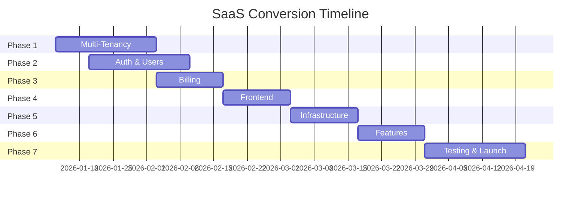

# BillingTool Master Documentation

This document is a consolidated version of all documentation files found in the project root. Use the Table of Contents below to navigate between different sections.

---

## Table of Contents

1. [Project Overview (README)](#1-project-overview-readme)
2. [System Architecture & Modules](#2-system-architecture--modules)
3. [SaaS Conversion Plan](#3-saas-conversion-plan)
4. [Admin Portal User Guide](#4-admin-portal-user-guide)
5. [SaaS Platform End User Guide](#5-saas-platform-end-user-guide)
6. [Developer Quick Reference Guide](#6-developer-quick-reference-guide)
7. [Frontend Build & Runtime Config](#7-frontend-build--runtime-config)
8. [PHP Installer Guide](#8-php-installer-guide)
9. [Config.js Explained](#9-configjs-explained)
10. [Quick Deployment Guide](#10-quick-deployment-guide)
11. [General Deployment Guide](#11-general-deployment-guide)
12. [Deployment Checklist](#12-deployment-checklist)
13. [Shared Hosting Deployment Guide](#13-shared-hosting-deployment-guide)
14. [Subdomain Setup Guide](#14-subdomain-setup-guide)
15. [Invoice PDF Refactor Implementation](#15-invoice-pdf-refactor-implementation)
16. [PDF Page Dimensions Reference](#16-pdf-page-dimensions-reference)
17. [PDF Generation Comparison (Old vs New)](#17-pdf-generation-comparison-old-vs-new)

---

## 1. Project Overview (README)

# Billing Tool UI Design

This is a code bundle for Billing Tool UI Design. The original project is available at https://www.figma.com/design/lgUWTecGtDVN1N2tzCjAyk/Billing-Tool-UI-Design.

## Running the code

Run `npm i` to install the dependencies.

Run `npm run dev` to start the development server.

---

## 2. System Architecture & Modules

# BillingTool System Architecture & Modules

This document provides a technical overview of how each module in the BillingTool SaaS system works and interacts with other components.

### 2.1. Multi-Tenancy & Isolation
The system is built as a multi-tenant SaaS.
- **Tenant Isolation**: Handled via `TenantFilter.php`. It extracts the subdomain from the host (e.g., `company.billingtool.com`) and identifies the tenant.
- **Data Scoping**: Every database model (extending `BaseModel`) uses the `TenantScope` trait. This automatically injects a `tenant_id` filter into every query, ensuring users never see data from other companies.
- **Subdomain Routing**: The frontend derives the tenant identity from the URL, which the backend validates against the `tenants` table.

### 2.2. Authentication & RBAC (Role-Based Access Control)
- **Hybrid Authentication**: Supports both Session-based auth (for browser users) and JWT-based auth (for API clients).
- **RBAC**: Permissions are granularly managed. The `RbacFilter` checks if the logged-in user has the required "right" (e.g., `invoices.create`, `admin.manage`) before allowing access to specific API routes.
- **Common Service**: `authService` in the frontend handles login/logout and synchronizes user state across modules.

### 2.3. Invoice Management
The core functional module of the system.
- **Editor**: A dynamic React-based editor that allows real-time calculation of taxes, totals, and compliant line items.
- **Compliance (EN 16931)**: Includes a validation engine that checks invoices against European E-Invoicing standards.
- **Status Lifecycle**: Invoices move through states: `Draft` -> `Validated` -> `Sent` -> `Paid` -> `Cancelled`.
- **Digital Signatures**: Supports applying digital signatures to invoices for non-repudiation.

### 2.4. AI Invoice Assistant
- **Natural Language Parsing**: Uses the `AIInvoiceController` to transform natural language prompts (e.g., "Create an invoice for 5 bags of cement") into structured UBL-compliant JSON.
- **Integration**: Plugs directly into the Invoice Editor, allowing users to "talk" to their invoicing system.

### 2.5. Activity Log & Auditing
- **Centralized Logging**: Uses the `AuditTrait` to record every significant action (invoice creation, profile updates, data exports).
- **Compliance Audit**: Maintains a non-modifiable record of who did what and when, essential for financial transparency.
- **Tenant Filtering**: Audit logs are subject to the same strict tenant isolation as invoices.

### 2.6. Billing & Subscription Management
- **SaaS Packages**: Defined by Admins in the `AdminPackages` module. Each package has specific limits (Invoices, Storage, API calls).
- **Usage Tracking**: Monitors tenant activity against their plan limits in real-time.
- **Billing History**: Tracks payments and subscription renewals for each tenant.

### 2.7. Company Profiles & Templates
- **Branding**: The `CompanyProfile` module allows tenants to set their logos, bank details, and custom header/footer text.
- **Templates**: Users can save common invoice configurations as templates to speed up creation. These are stored per-tenant.

### 2.8. Administration Portal (Super Admin)
A high-level dashboard for platform owners to:
- **Analytics**: High-level revenue and user growth charts.
- **User Management**: Ability to suspend or activate entire customer workspaces.
- **Package Management**: CRUD operations on the system-wide subscription plans.
- **System-wide Audit**: Unified view of activity across all tenants.

### 2.9. Technology Stack
- **Frontend**: React (Vite), Tailwind CSS, Lucide Icons, Shadcn UI.
- **Backend**: PHP (CodeIgniter 4), MySql.
- **API Architecture**: RESTful API with JSON responses and standardized error handling.

---

## 3. SaaS Conversion Plan

# SaaS Conversion Plan: BillingTool

## Executive Summary

This document outlines the complete plan to convert BillingTool from a standalone application into a production-ready, multi-tenant SaaS platform. The conversion will enable subscription-based revenue, scalable architecture, and automated customer onboarding.

**Timeline:** 8-12 weeks  
**Budget:** €15,000-25,000  
**Expected ROI:** 272% Year 1

---

## Phase 1: Multi-Tenancy Architecture (Weeks 1-3)

### 1.1 Database Schema Updates

**Objective:** Implement tenant isolation and data segregation

**Tasks:**
- [ ] Create `tenants` table
  - `id`, `company_name`, `subdomain`, `custom_domain`, `plan_id`, `status`, `created_at`
- [ ] Create `subscriptions` table
  - `id`, `tenant_id`, `plan_id`, `status`, `current_period_start`, `current_period_end`, `stripe_subscription_id`
- [ ] Create `plans` table
  - `id`, `name`, `price`, `billing_period`, `features`, `limits` (JSON)
- [ ] Add `tenant_id` foreign key to all existing tables
  - `invoices`, `templates`, `users`, `settings`, `activity_logs`
- [ ] Create database migration scripts
- [ ] Implement tenant-scoped queries (global scope in models)

**Database Schema:**
```sql
CREATE TABLE tenants (
    id INT PRIMARY KEY AUTO_INCREMENT,
    company_name VARCHAR(255) NOT NULL,
    subdomain VARCHAR(100) UNIQUE NOT NULL,
    custom_domain VARCHAR(255) NULL,
    plan_id INT NOT NULL,
    status ENUM('active', 'suspended', 'cancelled') DEFAULT 'active',
    trial_ends_at DATETIME NULL,
    created_at TIMESTAMP DEFAULT CURRENT_TIMESTAMP,
    updated_at TIMESTAMP DEFAULT CURRENT_TIMESTAMP ON UPDATE CURRENT_TIMESTAMP,
    FOREIGN KEY (plan_id) REFERENCES plans(id)
);

CREATE TABLE subscriptions (
    id INT PRIMARY KEY AUTO_INCREMENT,
    tenant_id INT NOT NULL,
    plan_id INT NOT NULL,
    stripe_subscription_id VARCHAR(255) UNIQUE,
    status ENUM('active', 'past_due', 'cancelled', 'trialing') DEFAULT 'trialing',
    current_period_start DATETIME,
    current_period_end DATETIME,
    cancel_at_period_end BOOLEAN DEFAULT FALSE,
    created_at TIMESTAMP DEFAULT CURRENT_TIMESTAMP,
    FOREIGN KEY (tenant_id) REFERENCES tenants(id),
    FOREIGN KEY (plan_id) REFERENCES plans(id)
);

CREATE TABLE plans (
    id INT PRIMARY KEY AUTO_INCREMENT,
    name VARCHAR(100) NOT NULL,
    slug VARCHAR(50) UNIQUE NOT NULL,
    price DECIMAL(10,2) NOT NULL,
    billing_period ENUM('monthly', 'yearly') DEFAULT 'monthly',
    features JSON,
    limits JSON,
    is_active BOOLEAN DEFAULT TRUE,
    created_at TIMESTAMP DEFAULT CURRENT_TIMESTAMP
);
```

**Deliverables:**
- Migration files for new tables
- Updated models with tenant scoping
- Seeder for default plans

**Estimated Time:** 40 hours

---

### 1.2 Tenant Middleware & Isolation

**Objective:** Automatic tenant detection and data isolation

**Tasks:**
- [ ] Create `TenantMiddleware.php`
  - Detect tenant from subdomain or custom domain
  - Set global tenant context
  - Handle tenant not found errors
- [ ] Implement `TenantScope` trait for models
  - Auto-filter queries by tenant_id
  - Prevent cross-tenant data access
- [ ] Create `Tenant` model with helper methods
- [ ] Update all controllers to use tenant-scoped queries
- [ ] Add tenant validation in API requests

**Implementation:**
```php
// app/Filters/TenantFilter.php
class TenantFilter implements FilterInterface {
    public function before(RequestInterface $request, $arguments = null) {
        $host = $request->getUri()->getHost();
        $subdomain = $this->extractSubdomain($host);
        
        $tenant = model(TenantModel::class)->where('subdomain', $subdomain)->first();
        
        if (!$tenant) {
            return Services::response()->setJSON([
                'error' => 'Tenant not found'
            ])->setStatusCode(404);
        }
        
        // Set global tenant context
        config('App')->tenant = $tenant;
    }
}

// app/Models/BaseModel.php
trait TenantScope {
    protected function beforeFind(array $data) {
        if (config('App')->tenant) {
            $this->where('tenant_id', config('App')->tenant->id);
        }
    }
}
```

**Deliverables:**
- Tenant middleware
- Tenant scope trait
- Updated base model
- Tenant helper functions

**Estimated Time:** 30 hours

---

## Phase 2: Authentication & User Management (Weeks 2-3)

### 2.1 Multi-Tenant Authentication

**Objective:** Separate authentication per tenant with role-based access

**Tasks:**
- [ ] Update user authentication to include tenant context
- [ ] Create tenant admin role
- [ ] Implement user invitation system
- [ ] Add email verification
- [ ] Create password reset flow (tenant-scoped)
- [ ] Implement session management per tenant
- [ ] Add OAuth support (Google, Microsoft) - optional

**User Roles:**
- **Tenant Owner** - Full access, billing management
- **Admin** - Full access to invoices and settings
- **Manager** - Create/edit invoices, view reports
- **User** - View and create invoices only

**Deliverables:**
- Updated authentication system
- User invitation emails
- Role-based permissions
- Email verification

**Estimated Time:** 35 hours

---

### 2.2 Tenant Onboarding Flow

**Objective:** Automated signup and tenant provisioning

**Tasks:**
- [ ] Create signup landing page
- [ ] Build registration form (company name, email, password)
- [ ] Implement subdomain validation and availability check
- [ ] Auto-create tenant on signup
- [ ] Auto-create first user (owner)
- [ ] Send welcome email with setup instructions
- [ ] Create onboarding wizard (5 steps)
  1. Company profile
  2. Invoice settings
  3. Template selection
  4. Team invitation
  5. First invoice creation

**Deliverables:**
- Signup page
- Tenant provisioning API
- Onboarding wizard
- Welcome email templates

**Estimated Time:** 40 hours

---

## Phase 3: Subscription & Billing (Weeks 4-5)

### 3.1 Stripe Integration

**Objective:** Automated subscription billing and payment processing

**Tasks:**
- [ ] Set up Stripe account
- [ ] Install Stripe PHP SDK
- [ ] Create Stripe products and prices
- [ ] Implement subscription creation
- [ ] Handle webhook events
  - `customer.subscription.created`
  - `customer.subscription.updated`
  - `customer.subscription.deleted`
  - `invoice.payment_succeeded`
  - `invoice.payment_failed`
- [ ] Create billing portal integration
- [ ] Implement usage tracking (invoice count)
- [ ] Add overage handling

**Stripe Products:**
```php
// Starter Plan
[
    'name' => 'Starter',
    'price' => 1900, // €19.00
    'interval' => 'month',
    'features' => [
        'invoices_per_month' => 50,
        'users' => 1,
        'templates' => 3,
        'support' => 'email'
    ]
]

// Professional Plan
[
    'name' => 'Professional',
    'price' => 4900, // €49.00
    'interval' => 'month',
    'features' => [
        'invoices_per_month' => 500,
        'users' => 3,
        'templates' => 'unlimited',
        'support' => 'priority'
    ]
]
```

**Deliverables:**
- Stripe integration
- Webhook handler
- Billing portal
- Usage tracking system

**Estimated Time:** 50 hours

---

### 3.2 Plan Limits & Usage Enforcement

**Objective:** Enforce subscription limits and handle upgrades

**Tasks:**
- [ ] Create `UsageTracker` service
- [ ] Implement invoice count tracking
- [ ] Add user limit enforcement
- [ ] Create upgrade prompts
- [ ] Implement plan comparison page
- [ ] Add downgrade handling
- [ ] Create usage dashboard for admins

**Limit Enforcement:**
```php
class UsageTracker {
    public function canCreateInvoice($tenantId) {
        $tenant = Tenant::find($tenantId);
        $plan = $tenant->subscription->plan;
        $currentMonth = date('Y-m');
        
        $invoiceCount = Invoice::where('tenant_id', $tenantId)
            ->where('created_at', '>=', $currentMonth . '-01')
            ->count();
        
        return $invoiceCount < $plan->limits['invoices_per_month'];
    }
}
```

**Deliverables:**
- Usage tracking service
- Limit enforcement middleware
- Upgrade/downgrade flows
- Usage analytics

**Estimated Time:** 30 hours

---

## Phase 4: SaaS Frontend Updates (Weeks 5-6)

### 4.1 Tenant-Aware Frontend

**Objective:** Update React app for multi-tenant architecture

**Tasks:**
- [ ] Add tenant context to React app
- [ ] Update API client with tenant headers
- [ ] Create tenant switcher (for multi-tenant users)
- [ ] Add subdomain routing
- [ ] Update authentication flow
- [ ] Create billing/subscription pages
- [ ] Add usage indicators
- [ ] Implement plan upgrade UI

**React Context:**
```typescript
interface TenantContextType {
    tenant: Tenant;
    subscription: Subscription;
    usage: Usage;
    canCreateInvoice: boolean;
    upgradeRequired: boolean;
}

const TenantContext = createContext<TenantContextType>(null);
```

**Deliverables:**
- Tenant context provider
- Updated API client
- Billing pages
- Usage indicators

**Estimated Time:** 40 hours

---

### 4.2 Marketing Website

**Objective:** Public-facing website with pricing and signup

**Tasks:**
- [ ] Create landing page
  - Hero section
  - Features showcase
  - Pricing table
  - Testimonials
  - FAQ
  - CTA buttons
- [ ] Create pricing page
- [ ] Create about page
- [ ] Create contact page
- [ ] Add signup flow
- [ ] Implement SEO optimization
- [ ] Add analytics (Google Analytics, Plausible)

**Deliverables:**
- Marketing website
- Pricing page
- Signup integration
- SEO optimization

**Estimated Time:** 50 hours

---

## Phase 5: Infrastructure & Deployment (Weeks 6-7)

### 5.1 Production Infrastructure

**Objective:** Scalable, secure production environment

**Tasks:**
- [ ] Set up cloud hosting (AWS, DigitalOcean, or Hetzner)
- [ ] Configure load balancer
- [ ] Set up database (managed MySQL/PostgreSQL)
- [ ] Configure Redis for caching and sessions
- [ ] Set up CDN for static assets
- [ ] Configure SSL certificates (Let's Encrypt)
- [ ] Implement automated backups
- [ ] Set up monitoring (UptimeRobot, Sentry)
- [ ] Configure logging (CloudWatch, Papertrail)

**Infrastructure Stack:**
- **Web Server:** Nginx + PHP-FPM
- **Database:** Managed MySQL 8.0
- **Cache:** Redis
- **CDN:** CloudFlare
- **Monitoring:** Sentry + UptimeRobot
- **Backups:** Daily automated

**Deliverables:**
- Production servers
- Database setup
- Monitoring dashboards
- Backup system

**Estimated Time:** 40 hours

---

### 5.2 CI/CD Pipeline

**Objective:** Automated testing and deployment

**Tasks:**
- [ ] Set up GitHub Actions
- [ ] Create test pipeline
- [ ] Create deployment pipeline
- [ ] Implement zero-downtime deployments
- [ ] Add database migration automation
- [ ] Create staging environment
- [ ] Set up environment variables management

**GitHub Actions Workflow:**
```yaml
name: Deploy to Production
on:
  push:
    branches: [main]
jobs:
  deploy:
    runs-on: ubuntu-latest
    steps:
      - uses: actions/checkout@v2
      - name: Run tests
      - name: Build frontend
      - name: Deploy to production
      - name: Run migrations
      - name: Clear cache
```

**Deliverables:**
- CI/CD pipeline
- Automated deployments
- Staging environment

**Estimated Time:** 30 hours

---

## Phase 6: Features & Enhancements (Weeks 7-8)

### 6.1 Team Collaboration

**Objective:** Multi-user support within tenants

**Tasks:**
- [ ] Create team management page
- [ ] Implement user invitation
- [ ] Add role assignment
- [ ] Create activity feed
- [ ] Add commenting on invoices
- [ ] Implement notifications

**Deliverables:**
- Team management
- User invitations
- Activity feed
- Notifications

**Estimated Time:** 35 hours

---

### 6.2 Analytics & Reporting

**Objective:** Business insights for tenants

**Tasks:**
- [ ] Create analytics dashboard
- [ ] Add revenue charts
- [ ] Implement invoice status tracking
- [ ] Create export reports
- [ ] Add email reports (weekly/monthly)

**Deliverables:**
- Analytics dashboard
- Report generation
- Email reports

**Estimated Time:** 30 hours

---

## Phase 7: Testing & Launch (Weeks 8-10)

### 7.1 Comprehensive Testing

**Tasks:**
- [ ] Unit tests for critical functions
- [ ] Integration tests for API
- [ ] E2E tests for user flows
- [ ] Load testing (100+ concurrent users)
- [ ] Security audit
- [ ] Penetration testing
- [ ] Browser compatibility testing

**Estimated Time:** 40 hours

---

### 7.2 Beta Launch

**Tasks:**
- [ ] Recruit 20-50 beta users
- [ ] Offer free trial (30 days)
- [ ] Collect feedback
- [ ] Fix critical bugs
- [ ] Optimize performance
- [ ] Prepare launch materials

**Estimated Time:** 30 hours

---

### 7.3 Public Launch

**Tasks:**
- [ ] Product Hunt launch
- [ ] Press release
- [ ] Social media campaign
- [ ] Email marketing
- [ ] Monitor metrics
- [ ] Provide customer support

**Estimated Time:** 20 hours

---

## Technical Requirements

### Backend Requirements

**New Dependencies:**
```json
{
    "stripe/stripe-php": "^10.0",
    "predis/predis": "^2.0",
    "aws/aws-sdk-php": "^3.0"
}
```

**New Services:**
- Stripe for payments
- Redis for caching
- Email service (SendGrid/Mailgun)
- SMS service (Twilio) - optional

### Frontend Requirements

**New Dependencies:**
```json
{
    "@stripe/stripe-js": "^2.0",
    "@stripe/react-stripe-js": "^2.0",
    "recharts": "^2.5"
}
```

---

## Cost Breakdown

### Development Costs

| Phase | Hours | Rate | Cost |
|-------|-------|------|------|
| Multi-Tenancy | 70 | €75 | €5,250 |
| Auth & User Mgmt | 75 | €75 | €5,625 |
| Billing | 80 | €75 | €6,000 |
| Frontend | 90 | €75 | €6,750 |
| Infrastructure | 70 | €75 | €5,250 |
| Features | 65 | €75 | €4,875 |
| Testing & Launch | 90 | €75 | €6,750 |
| **Total** | **540** | - | **€40,500** |

### Monthly Operating Costs

| Service | Cost |
|---------|------|
| Hosting (VPS) | €50-100 |
| Database | €30-50 |
| CDN | €20-40 |
| Email Service | €10-30 |
| Monitoring | €20-40 |
| Stripe Fees | 2.9% + €0.30 per transaction |
| **Total** | **€130-260/month** |

---

## Success Metrics

### Key Performance Indicators (KPIs)

**Month 1:**
- 50 signups
- 20 paying customers
- €980 MRR
- 40% conversion rate

**Month 3:**
- 200 signups
- 100 paying customers
- €4,900 MRR
- 50% conversion rate

**Month 6:**
- 500 signups
- 300 paying customers
- €14,700 MRR
- 60% conversion rate

**Month 12:**
- 1,500 signups
- 800 paying customers
- €39,200 MRR
- 53% conversion rate

### Financial Projections

**Year 1:**
- MRR: €39,200
- ARR: €470,400
- Costs: €180,000
- **Profit: €290,400**

---

## Risk Mitigation

### Technical Risks

| Risk | Mitigation |
|------|------------|
| Data isolation breach | Comprehensive testing, code review |
| Performance issues | Load testing, caching, optimization |
| Downtime | Redundancy, monitoring, backups |
| Security vulnerabilities | Security audit, penetration testing |

### Business Risks

| Risk | Mitigation |
|------|------------|
| Low adoption | Strong marketing, free trial |
| High churn | Customer success, feature improvements |
| Competition | Unique features, better UX |
| Pricing issues | A/B testing, market research |

---

## Timeline Summary



**Total Duration:** 10-12 weeks  
**Launch Date:** April 2026

---

## Next Steps

### Immediate Actions (This Week)

1. ✅ Review this plan
2. ✅ Set up development environment
3. ✅ Create project repository
4. ✅ Set up Stripe account
5. ✅ Begin Phase 1 implementation

### Week 1 Deliverables

- Database schema updates
- Tenant middleware
- Basic multi-tenancy working

---

## Conclusion

This plan provides a comprehensive roadmap to convert BillingTool into a production-ready SaaS platform. Following this plan will result in:

✅ **Scalable Architecture** - Multi-tenant, cloud-ready  
✅ **Automated Billing** - Stripe integration  
✅ **Professional Frontend** - Marketing site + app  
✅ **Production Infrastructure** - Secure, monitored  
✅ **Revenue Generation** - €470K ARR potential  

**Estimated Investment:** €40,500 development + €15,000 infrastructure  
**Expected ROI:** 272% Year 1  
**Break-Even:** 6-9 months  

---

**Version:** 1.0.0  
**Date:** January 11, 2026  
**Status:** Ready for Implementation ✅

---

## 4. Admin Portal User Guide

# SaaS Billing Tool - Complete User Guide

## Introduction

The SaaS Billing Tool is a comprehensive admin portal for managing your SaaS platform. It provides tools for package management, user administration, billing tracking, and usage analytics.

### Key Features
- 📦 **Package Management** - Create and manage subscription tiers
- 👥 **User Administration** - Monitor and manage customer accounts
- 💰 **Billing Tracking** - Track revenue and invoices
- 📊 **Usage Analytics** - Monitor platform usage and metrics
- ⚙️ **Settings** - Configure platform settings

---

## Getting Started

### System Requirements
- **Frontend**: Node.js 18+ and npm
- **Backend**: PHP 8.1+ with CodeIgniter 4
- **Browser**: Modern browser (Chrome, Firefox, Safari, Edge)

### Installation

#### 1. Backend Setup
```bash
cd api
composer install
cp env .env
# Configure database in .env file
php spark migrate
php spark serve
```

#### 2. Frontend Setup
```bash
npm install
npm run dev
```

### First Login

1. Navigate to `http://localhost:3000/#/SALogin`
2. **Default Credentials:**
   - Email: `admin@example.com`
   - Password: `admin123`
3. Click "Sign In"

> ⚠️ **Important**: Change the default password immediately after first login!

---

## Admin Portal Features

### Dashboard Overview

The dashboard provides a quick overview of your platform:

- **Total Users** - Current number of registered users
- **Active Subscriptions** - Number of paying customers
- **Monthly Revenue** - Current month's revenue
- **API Calls** - Total API usage across all users

#### Key Metrics Cards
- Total Revenue (all-time)
- New Users This Month
- Churn Rate
- Average Revenue Per User (ARPU)

---

## Package Management

### Viewing Packages

1. Click **"Packages"** in the sidebar
2. View all available subscription tiers
3. Use the search bar to filter packages
4. Each package card shows:
   - Package name and description
   - Monthly price
   - Feature list
   - Status (Active/Inactive)

### Creating a New Package

1. Click **"Add Package"** button
2. Fill in the package details:
   - **Name**: Package tier name (e.g., "Professional")
   - **Description**: Brief description of the package
   - **Price**: Monthly price in USD
   - **Currency**: USD (default)
   - **Duration**: Monthly/Yearly
   - **Status**: Active/Inactive

3. Add **Features**:
   - **Storage**: e.g., "50GB"
   - **Users**: e.g., "5 users"
   - **Bandwidth**: e.g., "500GB/month"
   - Add custom features as needed

4. Click **"Create Package"**

### Editing a Package

1. Find the package in the list
2. Click the **"Edit"** button
3. Modify the details
4. Click **"Update Package"**

### Deleting a Package

1. Find the package in the list
2. Click the **"Delete"** button
3. Confirm the deletion

> ⚠️ **Warning**: Deleting a package will affect users currently subscribed to it. Consider marking it as "Inactive" instead.

---

## User Management

### Viewing Users

1. Click **"Users"** in the sidebar
2. View all registered users in a table format
3. **Filter Options**:
   - Search by name or email
   - Filter by status (Active/Suspended/Inactive)
   - Sort by name, email, joined date, or last login

### User Details

Click the **eye icon** (👁️) on any user to view:

#### Basic Information
- Name and email
- Account status
- Join date

#### Subscription Details
- Current package
- Subscription start date
- Next billing date
- Monthly amount

#### Payment Information
- Payment method
- Billing email
- Auto-renewal status

#### Invoice History
- Past invoices with dates and amounts
- Payment status (Paid/Overdue)
- Download individual invoices

#### Usage Statistics
- Storage used vs. limit
- API calls this month
- Bandwidth consumed
- Usage trend charts

### User Actions

#### Send Payment Reminder
1. Open user details
2. Click **"Send Reminder"** button
3. Confirmation toast will appear

#### Suspend User
1. Open user details
2. Click **"Suspend"** button
3. User account will be suspended immediately
4. User won't be able to access the platform

#### Activate User
1. Open suspended user details
2. Click **"Activate"** button
3. User account will be reactivated

### Exporting User Data

1. Go to Users page
2. Click **"Export CSV"** button
3. CSV file will download with all user data

---

## Billing & Revenue

### Viewing Billing Data

1. Click **"Billing"** in the sidebar
2. View billing overview with:
   - Total invoices
   - Paid invoices
   - Pending payments
   - Overdue invoices

### Invoice Management

#### Invoice List
- View all invoices in chronological order
- Filter by status (Paid/Pending/Overdue)
- Search by invoice ID or customer

#### Invoice Details
- Customer information
- Invoice date and due date
- Line items and amounts
- Payment status
- Download PDF invoice

### Revenue Analytics

View revenue trends:
- Monthly revenue chart
- Revenue by package type
- Payment success rate
- Revenue forecasts

---

## Usage Analytics

### Platform Usage Overview

1. Click **"Usage"** in the sidebar
2. View platform-wide metrics:

#### Summary Cards
- **Total Storage Used** - Aggregate across all users
- **API Calls** - Total API requests
- **Bandwidth Used** - Total data transfer
- **Active Sessions** - Current active users

#### Usage Charts
- **Storage Over Time** - Trend of storage consumption
- **API Calls Over Time** - API usage patterns
- **Bandwidth Usage** - Data transfer trends
- **Active Sessions** - Concurrent user activity

### Time Period Filters
- Daily view
- Weekly view
- Monthly view
- Yearly view

### Exporting Usage Data

1. Click **"Export to CSV"** button
2. Select time period
3. Download usage report

---

## Settings

### General Settings

1. Click **"Settings"** in the sidebar
2. Configure platform settings:

#### Platform Configuration
- Platform name
- Support email
- Default currency
- Time zone

#### Email Settings
- SMTP configuration
- Email templates
- Notification preferences

#### Payment Settings
- Payment gateway configuration
- Supported payment methods
- Tax settings

### Admin Account Settings

- Update admin profile
- Change password
- Two-factor authentication
- Session timeout settings

---

## Troubleshooting

### Common Issues

#### Cannot Login
**Problem**: Invalid credentials error  
**Solution**:
1. Verify email and password
2. Check caps lock is off
3. Try password reset if available
4. Contact system administrator

#### CORS Errors
**Problem**: API requests blocked by CORS  
**Solution**:
1. Ensure backend server is running (`php spark serve`)
2. Check API URL in frontend configuration
3. Verify CORS filter is enabled in backend

#### Data Not Loading
**Problem**: Empty tables or missing data  
**Solution**:
1. Check browser console for errors
2. Verify backend API is responding
3. Check network tab for failed requests
4. Clear browser cache and reload

#### Package/User Actions Not Working
**Problem**: Create/Update/Delete operations fail  
**Solution**:
1. Check form validation errors
2. Verify all required fields are filled
3. Check backend logs for errors
4. Ensure proper authentication

---

## Best Practices

### Security
- ✅ Change default admin password immediately
- ✅ Use strong, unique passwords
- ✅ Enable two-factor authentication
- ✅ Regularly review user access
- ✅ Monitor suspicious activity

---

## Keyboard Shortcuts

| Shortcut | Action |
|----------|--------|
| `Ctrl/Cmd + K` | Quick search |
| `Esc` | Close modal/dialog |
| `Ctrl/Cmd + S` | Save form (when editing) |
| `Ctrl/Cmd + /` | Show keyboard shortcuts |

---

## API Integration

### Authentication

All API requests require authentication:

```bash
# Login to get token
curl -X POST http://localhost:8080/admin/auth/login \
  -H "Content-Type: application/json" \
  -d '{"email":"admin@example.com","password":"admin123"}'

# Use token in subsequent requests
curl -X GET http://localhost:8080/admin/users \
  -H "Authorization: Bearer YOUR_TOKEN_HERE"
```

### Available Endpoints

#### Packages
- `GET /admin/packages` - List all packages
- `GET /admin/packages/:id` - Get package details
- `POST /admin/packages` - Create package
- `PUT /admin/packages/:id` - Update package
- `DELETE /admin/packages/:id` - Delete package

#### Users
- `GET /admin/users` - List all users
- `GET /admin/users/:id` - Get user details
- `POST /admin/users/:id/suspend` - Suspend user
- `POST /admin/users/:id/activate` - Activate user
- `GET /admin/users/export` - Export users CSV

#### Analytics
- `GET /admin/analytics/dashboard` - Dashboard stats
- `GET /admin/usage` - Usage metrics
- `GET /admin/usage/export` - Export usage CSV

#### Billing
- `GET /admin/billing` - List invoices
- `GET /admin/billing/revenue` - Revenue data

---

## Glossary

- **ARPU**: Average Revenue Per User
- **Churn Rate**: Percentage of users who cancel subscriptions
- **MRR**: Monthly Recurring Revenue
- **Package**: Subscription tier or plan
- **Subdomain**: Custom domain for each user
- **Usage Limit**: Maximum allowed resource consumption
- **Active Subscription**: Currently paying customer

---

## Version History

### v1.0.0 (Current)
- Initial release
- Package management
- User administration
- Billing tracking
- Usage analytics
- Admin settings

---

## Contact & Support

For additional help or feature requests:
- **Email**: support@example.com
- **Documentation**: https://docs.example.com
- **GitHub**: https://github.com/sivaji786/BillingToolSaaS

---

**Last Updated**: January 19, 2026  
**Version**: 1.0.0

---

## 5. SaaS Platform End User Guide

# SaaS Billing Tool - End User Guide

## Welcome! 👋

This guide will help you get started with the SaaS Billing Tool, create professional invoices, manage your account, and make the most of your subscription.

---

## Table of Contents

1. [Getting Started](#getting-started)
2. [Creating Your Account](#creating-your-account-1)
3. [Choosing Your Plan](#choosing-your-plan)
4. [Logging In](#logging-in-1)
5. [Dashboard Overview](#dashboard-overview)
6. [Creating Invoices](#creating-invoices-1)
7. [Managing Invoices](#managing-invoices-1)
8. [Using Templates](#using-templates-1)
9. [Account Settings](#account-settings)
10. [Billing & Subscription](#billing--subscription-1)
11. [Tips & Best Practices](#tips--best-practices)
12. [Troubleshooting](#troubleshooting-1)

---

## Getting Started

### What is the SaaS Billing Tool?

The SaaS Billing Tool is a professional invoicing platform that helps you:
- ✅ Create beautiful, professional invoices
- ✅ Manage clients and billing information
- ✅ Track payments and invoice status
- ✅ Use customizable templates
- ✅ Generate reports and analytics

### System Requirements

- **Browser**: Chrome, Firefox, Safari, or Edge (latest version)
- **Internet**: Stable internet connection
- **Email**: Valid email address for account creation

---

## Creating Your Account

### Step 1: Visit the Landing Page

1. Go to your platform URL
2. You'll see the landing page with pricing plans

### Step 2: Choose a Plan

Review the available plans (Starter, Professional, Business, Enterprise).

### Step 3: Sign Up

1. Click **"Get Started"** or **"Sign Up"**
2. Fill in the signup form (Name, Company, Email, Password)
3. Your account will be created instantly with a unique subdomain.

### Step 4: Account Activation

Your account is **immediately active** after signup! 

---

## Logging In

1. Go to the login page
2. Enter your **email address** and **password**
3. Click **"Sign In"**

---

## Dashboard Overview

- **Quick Stats**: Total Invoices, Pending, Paid, Revenue.
- **Recent Activity**: Latest events.
- **Quick Actions**: Create Invoice, Templates, Activity Log, Settings.

---

## Creating Invoices

1. Click **"Create Invoice"**
2. Fill in Client Info, Invoice Details, and Line Items.
3. Add tax/discounts/notes.
4. Preview and Save/Send.

---

## Managing Invoices

- **Invoices Page**: View all invoices in a table.
- **Filters**: Search by status, date, or client.
- **Actions**: View, Edit, Download PDF, Send, Mark as Paid, Delete.

---

## Using Templates

1. Click **"Templates"**
2. Browse, Create, or Edit templates.
3. Set a default template for your workspace.

---

## Account Settings

- **Profile**: Name, Email, Address.
- **Branding**: Logo, Colors, Signature.
- **Payment**: Bank details, Gateway settings.
- **Notifications**: Alerts and reports.

---

## Billing & Subscription

- **Plan Details**: View current tier and usage.
- **Upgrades**: Change your plan manually.
- **Payments**: Update card info and view history.

---

## Tips & Best Practices

- Use clear descriptions.
- Include payment terms.
- Add your logo for branding.
- Follow up with automated reminders.

---

## Troubleshooting

- **Login issues**: Check caps lock, try password reset.
- **Delivery issues**: Check spam, verify email address.
- **Upload issues**: Max 5MB, JPG/PNG formats.

---

## Keyboard Shortcuts

| Shortcut | Action |
|----------|--------|
| `Ctrl/Cmd + N` | New invoice |
| `Ctrl/Cmd + S` | Save invoice |
| `Ctrl/Cmd + P` | Preview invoice |
| `Ctrl/Cmd + K` | Quick search |

---

## Privacy & Security

- All data is encrypted and backed up daily.
- You own 100% of your data.

---

**Last Updated**: January 19, 2026  
**Version**: 1.0.0

---

## 6. Developer Quick Reference Guide

# Invoice PDF Generation - Quick Reference Guide

## Basic Usage

```typescript
import { printInvoiceHTML } from '../../utils/invoice-pdf-html';

// In your component
const handleDownloadPDF = () => {
  printInvoiceHTML(invoice, template, profile);
};
```

## Function Reference

### `generateInvoiceHTML(invoice, template?, profile?)`
Generates HTML string for the invoice.

### `downloadInvoiceHTML(invoice, template?, profile?)`
Downloads the invoice as an HTML file.

### `printInvoiceHTML(invoice, template?, profile?)`
Opens invoice in new window and triggers print dialog.

## Styling Rules
- Use professional colors (#000000 or #222222).
- Use sans-serif fonts (Arial, Helvetica).
- Right-align numeric columns.

## Troubleshooting
- **Logo not showing**: Ensure HTTPS and public access.
- **Print window blocked**: Allow popups in browser.

---

## 7. Frontend Build & Runtime Config

# How Frontend Build Works with Different Domains

## The Problem
Normally, API URLs are baked in at build time. For a multi-tenant SaaS, the API URL might change based on the domain or installation.

## The Solution: Runtime Configuration
We use `config.js` to load the API URL dynamically at runtime.

### The Flow
1. **Local Build**: Generate generic assets with `npm run build`.
2. **Packaging**: Assets are zipped.
3. **Installation**: The `installer.php` generates a `config.js` file with the server's specific domain.
4. **Runtime**: The browser loads `config.js` first, setting `window.APP_CONFIG.API_BASE_URL`.
5. **Request**: The application reads this value for all API calls.

---

## 8. PHP Installer Guide

# BillingTool PHP Installer

## Overview
Automates deployment to shared hosting by handling extraction, DB setup, and environment config.

## Requirements
- PHP 8.1+
- MySQL 5.7+
- Extensions: mysqli, zip, json, mbstring, curl

## Process
1. Build frontend (`npm run build`).
2. Package zipped application (`billingtool.zip`).
3. Upload `installer.php` and the zip to server.
4. Run `installer.php` via browser.
5. Follow the UI to configure DB and URLs.
6. Delete installer files after success.

---

## 9. Config.js Explained

# Does `npm run build` Create config.js?

- **Local Build**: Vite copies a template `config.js` (pointing to localhost) to the build folder.
- **Production**: The installer replaces this file with one containing the final production URL.

**Summary**: Your local build has it, but it's meant to be overwritten during deployment.

---

## 10. Quick Deployment Guide

# Quick Deployment Guide

1. **Package**: Run `./create-deployment-package.sh`.
2. **Upload**: Move `billingtool.zip` and `installer.php` to your web root.
3. **Install**: Go to `domain.com/installer.php`.
4. **Configure**: Enter DB details and Site URL.
5. **Clean up**: Delete the zip and installer.

---

## 11. General Deployment Guide

# Deployment Guide

- **Frontend**: React + Vite (SPA routing via `.htaccess`).
- **Backend**: CodeIgniter 4 (PHP-FPM + Nginx/Apache).
- **Environment**: Use `.env` files for production keys and DB secrets.

---

## 12. Deployment Checklist

# Deployment Checklist

- [ ] DB created and user permissions granted.
- [ ] Zip and installer uploaded.
- [ ] Installer run successfully.
- [ ] ZIP and Installer DELETED.
- [ ] Admin password changed.
- [ ] SSL (HTTPS) enabled.

---

## 13. Shared Hosting Deployment Guide

# Shared Hosting Deployment Guide

Focuses on cPanel environments:
1. Use phpMyAdmin for DB management.
2. Ensure PHP version is 8.1+ in cPanel MultiPHP Manager.
3. Set writable permissions (755) for `api/writable` folders.

---

## 14. Subdomain Setup Guide

# Auto-Creating Subdomains for SaaS

## Wildcard DNS (Recommended)
- Set up `*.domain.com` pointing to your IP.
- Nginx/Apache handles the routing to the same app build.
- Backend `TenantFilter` detects which subdomain is being used.

## Configuration
- **Cloudflare**: Add A record for `*`.
- **Nginx**: Use `server_name *.domain.com`.
- **SSL**: Use Wildcard cert from Let's Encrypt.

---

## 15. Invoice PDF Refactor Implementation

# Invoice PDF - Refactored Implementation

We transitioned from `jsPDF` to a pure HTML/Browser-Print approach.
- **Pros**: Higher quality, standard fonts, no heavy library, user control over margins.
- **Module**: `invoice-pdf-html.ts`.

---

## 16. PDF Page Dimensions Reference

# PDF Page Dimensions Reference

- **Format**: A4 (595.28pt x 841.89pt).
- **Margins**: 20pt (Left/Right/Top), 50pt (Bottom).
- **Safe Area**: 555pt x 771pt.

---

## 17. PDF Generation Comparison (Old vs New)

| Aspect | Old (jsPDF) | New (HTML) |
|--------|-------------|------------|
| Size | 600KB | 5KB |
| Speed | 3-5s | Instant |
| Quality| Good | Excellent |
| Maintenance| Hard | Easy |

---

**End of Consolidated Documentation**
