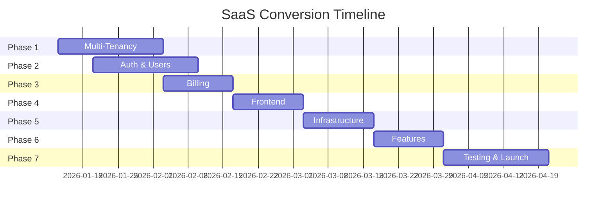

# SaaS Conversion Plan: BillingTool

## Executive Summary

This document outlines the complete plan to convert BillingTool from a standalone application into a production-ready, multi-tenant SaaS platform. The conversion will enable subscription-based revenue, scalable architecture, and automated customer onboarding.

**Timeline:** 8-12 weeks  
**Budget:** €15,000-25,000  
**Expected ROI:** 272% Year 1

---

## Phase 1: Multi-Tenancy Architecture (Weeks 1-3)

### 1.1 Database Schema Updates

**Objective:** Implement tenant isolation and data segregation

**Tasks:**
- [ ] Create `tenants` table
  - `id`, `company_name`, `subdomain`, `custom_domain`, `plan_id`, `status`, `created_at`
- [ ] Create `subscriptions` table
  - `id`, `tenant_id`, `plan_id`, `status`, `current_period_start`, `current_period_end`, `stripe_subscription_id`
- [ ] Create `plans` table
  - `id`, `name`, `price`, `billing_period`, `features`, `limits` (JSON)
- [ ] Add `tenant_id` foreign key to all existing tables
  - `invoices`, `templates`, `users`, `settings`, `activity_logs`
- [ ] Create database migration scripts
- [ ] Implement tenant-scoped queries (global scope in models)

**Database Schema:**
```sql
CREATE TABLE tenants (
    id INT PRIMARY KEY AUTO_INCREMENT,
    company_name VARCHAR(255) NOT NULL,
    subdomain VARCHAR(100) UNIQUE NOT NULL,
    custom_domain VARCHAR(255) NULL,
    plan_id INT NOT NULL,
    status ENUM('active', 'suspended', 'cancelled') DEFAULT 'active',
    trial_ends_at DATETIME NULL,
    created_at TIMESTAMP DEFAULT CURRENT_TIMESTAMP,
    updated_at TIMESTAMP DEFAULT CURRENT_TIMESTAMP ON UPDATE CURRENT_TIMESTAMP,
    FOREIGN KEY (plan_id) REFERENCES plans(id)
);

CREATE TABLE subscriptions (
    id INT PRIMARY KEY AUTO_INCREMENT,
    tenant_id INT NOT NULL,
    plan_id INT NOT NULL,
    stripe_subscription_id VARCHAR(255) UNIQUE,
    status ENUM('active', 'past_due', 'cancelled', 'trialing') DEFAULT 'trialing',
    current_period_start DATETIME,
    current_period_end DATETIME,
    cancel_at_period_end BOOLEAN DEFAULT FALSE,
    created_at TIMESTAMP DEFAULT CURRENT_TIMESTAMP,
    FOREIGN KEY (tenant_id) REFERENCES tenants(id),
    FOREIGN KEY (plan_id) REFERENCES plans(id)
);

CREATE TABLE plans (
    id INT PRIMARY KEY AUTO_INCREMENT,
    name VARCHAR(100) NOT NULL,
    slug VARCHAR(50) UNIQUE NOT NULL,
    price DECIMAL(10,2) NOT NULL,
    billing_period ENUM('monthly', 'yearly') DEFAULT 'monthly',
    features JSON,
    limits JSON,
    is_active BOOLEAN DEFAULT TRUE,
    created_at TIMESTAMP DEFAULT CURRENT_TIMESTAMP
);
```

**Deliverables:**
- Migration files for new tables
- Updated models with tenant scoping
- Seeder for default plans

**Estimated Time:** 40 hours

---

### 1.2 Tenant Middleware & Isolation

**Objective:** Automatic tenant detection and data isolation

**Tasks:**
- [ ] Create `TenantMiddleware.php`
  - Detect tenant from subdomain or custom domain
  - Set global tenant context
  - Handle tenant not found errors
- [ ] Implement `TenantScope` trait for models
  - Auto-filter queries by tenant_id
  - Prevent cross-tenant data access
- [ ] Create `Tenant` model with helper methods
- [ ] Update all controllers to use tenant-scoped queries
- [ ] Add tenant validation in API requests

**Implementation:**
```php
// app/Filters/TenantFilter.php
class TenantFilter implements FilterInterface {
    public function before(RequestInterface $request, $arguments = null) {
        $host = $request->getUri()->getHost();
        $subdomain = $this->extractSubdomain($host);
        
        $tenant = model(TenantModel::class)->where('subdomain', $subdomain)->first();
        
        if (!$tenant) {
            return Services::response()->setJSON([
                'error' => 'Tenant not found'
            ])->setStatusCode(404);
        }
        
        // Set global tenant context
        config('App')->tenant = $tenant;
    }
}

// app/Models/BaseModel.php
trait TenantScope {
    protected function beforeFind(array $data) {
        if (config('App')->tenant) {
            $this->where('tenant_id', config('App')->tenant->id);
        }
    }
}
```

**Deliverables:**
- Tenant middleware
- Tenant scope trait
- Updated base model
- Tenant helper functions

**Estimated Time:** 30 hours

---

## Phase 2: Authentication & User Management (Weeks 2-3)

### 2.1 Multi-Tenant Authentication

**Objective:** Separate authentication per tenant with role-based access

**Tasks:**
- [ ] Update user authentication to include tenant context
- [ ] Create tenant admin role
- [ ] Implement user invitation system
- [ ] Add email verification
- [ ] Create password reset flow (tenant-scoped)
- [ ] Implement session management per tenant
- [ ] Add OAuth support (Google, Microsoft) - optional

**User Roles:**
- **Tenant Owner** - Full access, billing management
- **Admin** - Full access to invoices and settings
- **Manager** - Create/edit invoices, view reports
- **User** - View and create invoices only

**Deliverables:**
- Updated authentication system
- User invitation emails
- Role-based permissions
- Email verification

**Estimated Time:** 35 hours

---

### 2.2 Tenant Onboarding Flow

**Objective:** Automated signup and tenant provisioning

**Tasks:**
- [ ] Create signup landing page
- [ ] Build registration form (company name, email, password)
- [ ] Implement subdomain validation and availability check
- [ ] Auto-create tenant on signup
- [ ] Auto-create first user (owner)
- [ ] Send welcome email with setup instructions
- [ ] Create onboarding wizard (5 steps)
  1. Company profile
  2. Invoice settings
  3. Template selection
  4. Team invitation
  5. First invoice creation

**Deliverables:**
- Signup page
- Tenant provisioning API
- Onboarding wizard
- Welcome email templates

**Estimated Time:** 40 hours

---

## Phase 3: Subscription & Billing (Weeks 4-5)

### 3.1 Stripe Integration

**Objective:** Automated subscription billing and payment processing

**Tasks:**
- [ ] Set up Stripe account
- [ ] Install Stripe PHP SDK
- [ ] Create Stripe products and prices
- [ ] Implement subscription creation
- [ ] Handle webhook events
  - `customer.subscription.created`
  - `customer.subscription.updated`
  - `customer.subscription.deleted`
  - `invoice.payment_succeeded`
  - `invoice.payment_failed`
- [ ] Create billing portal integration
- [ ] Implement usage tracking (invoice count)
- [ ] Add overage handling

**Stripe Products:**
```php
// Starter Plan
[
    'name' => 'Starter',
    'price' => 1900, // €19.00
    'interval' => 'month',
    'features' => [
        'invoices_per_month' => 50,
        'users' => 1,
        'templates' => 3,
        'support' => 'email'
    ]
]

// Professional Plan
[
    'name' => 'Professional',
    'price' => 4900, // €49.00
    'interval' => 'month',
    'features' => [
        'invoices_per_month' => 500,
        'users' => 3,
        'templates' => 'unlimited',
        'support' => 'priority'
    ]
]
```

**Deliverables:**
- Stripe integration
- Webhook handler
- Billing portal
- Usage tracking system

**Estimated Time:** 50 hours

---

### 3.2 Plan Limits & Usage Enforcement

**Objective:** Enforce subscription limits and handle upgrades

**Tasks:**
- [ ] Create `UsageTracker` service
- [ ] Implement invoice count tracking
- [ ] Add user limit enforcement
- [ ] Create upgrade prompts
- [ ] Implement plan comparison page
- [ ] Add downgrade handling
- [ ] Create usage dashboard for admins

**Limit Enforcement:**
```php
class UsageTracker {
    public function canCreateInvoice($tenantId) {
        $tenant = Tenant::find($tenantId);
        $plan = $tenant->subscription->plan;
        $currentMonth = date('Y-m');
        
        $invoiceCount = Invoice::where('tenant_id', $tenantId)
            ->where('created_at', '>=', $currentMonth . '-01')
            ->count();
        
        return $invoiceCount < $plan->limits['invoices_per_month'];
    }
}
```

**Deliverables:**
- Usage tracking service
- Limit enforcement middleware
- Upgrade/downgrade flows
- Usage analytics

**Estimated Time:** 30 hours

---

## Phase 4: SaaS Frontend Updates (Weeks 5-6)

### 4.1 Tenant-Aware Frontend

**Objective:** Update React app for multi-tenant architecture

**Tasks:**
- [ ] Add tenant context to React app
- [ ] Update API client with tenant headers
- [ ] Create tenant switcher (for multi-tenant users)
- [ ] Add subdomain routing
- [ ] Update authentication flow
- [ ] Create billing/subscription pages
- [ ] Add usage indicators
- [ ] Implement plan upgrade UI

**React Context:**
```typescript
interface TenantContextType {
    tenant: Tenant;
    subscription: Subscription;
    usage: Usage;
    canCreateInvoice: boolean;
    upgradeRequired: boolean;
}

const TenantContext = createContext<TenantContextType>(null);
```

**Deliverables:**
- Tenant context provider
- Updated API client
- Billing pages
- Usage indicators

**Estimated Time:** 40 hours

---

### 4.2 Marketing Website

**Objective:** Public-facing website with pricing and signup

**Tasks:**
- [ ] Create landing page
  - Hero section
  - Features showcase
  - Pricing table
  - Testimonials
  - FAQ
  - CTA buttons
- [ ] Create pricing page
- [ ] Create about page
- [ ] Create contact page
- [ ] Add signup flow
- [ ] Implement SEO optimization
- [ ] Add analytics (Google Analytics, Plausible)

**Deliverables:**
- Marketing website
- Pricing page
- Signup integration
- SEO optimization

**Estimated Time:** 50 hours

---

## Phase 5: Infrastructure & Deployment (Weeks 6-7)

### 5.1 Production Infrastructure

**Objective:** Scalable, secure production environment

**Tasks:**
- [ ] Set up cloud hosting (AWS, DigitalOcean, or Hetzner)
- [ ] Configure load balancer
- [ ] Set up database (managed MySQL/PostgreSQL)
- [ ] Configure Redis for caching and sessions
- [ ] Set up CDN for static assets
- [ ] Configure SSL certificates (Let's Encrypt)
- [ ] Implement automated backups
- [ ] Set up monitoring (UptimeRobot, Sentry)
- [ ] Configure logging (CloudWatch, Papertrail)

**Infrastructure Stack:**
- **Web Server:** Nginx + PHP-FPM
- **Database:** Managed MySQL 8.0
- **Cache:** Redis
- **CDN:** CloudFlare
- **Monitoring:** Sentry + UptimeRobot
- **Backups:** Daily automated

**Deliverables:**
- Production servers
- Database setup
- Monitoring dashboards
- Backup system

**Estimated Time:** 40 hours

---

### 5.2 CI/CD Pipeline

**Objective:** Automated testing and deployment

**Tasks:**
- [ ] Set up GitHub Actions
- [ ] Create test pipeline
- [ ] Create deployment pipeline
- [ ] Implement zero-downtime deployments
- [ ] Add database migration automation
- [ ] Create staging environment
- [ ] Set up environment variables management

**GitHub Actions Workflow:**
```yaml
name: Deploy to Production
on:
  push:
    branches: [main]
jobs:
  deploy:
    runs-on: ubuntu-latest
    steps:
      - uses: actions/checkout@v2
      - name: Run tests
      - name: Build frontend
      - name: Deploy to production
      - name: Run migrations
      - name: Clear cache
```

**Deliverables:**
- CI/CD pipeline
- Automated deployments
- Staging environment

**Estimated Time:** 30 hours

---

## Phase 6: Features & Enhancements (Weeks 7-8)

### 6.1 Team Collaboration

**Objective:** Multi-user support within tenants

**Tasks:**
- [ ] Create team management page
- [ ] Implement user invitation
- [ ] Add role assignment
- [ ] Create activity feed
- [ ] Add commenting on invoices
- [ ] Implement notifications

**Deliverables:**
- Team management
- User invitations
- Activity feed
- Notifications

**Estimated Time:** 35 hours

---

### 6.2 Analytics & Reporting

**Objective:** Business insights for tenants

**Tasks:**
- [ ] Create analytics dashboard
- [ ] Add revenue charts
- [ ] Implement invoice status tracking
- [ ] Create export reports
- [ ] Add email reports (weekly/monthly)

**Deliverables:**
- Analytics dashboard
- Report generation
- Email reports

**Estimated Time:** 30 hours

---

## Phase 7: Testing & Launch (Weeks 8-10)

### 7.1 Comprehensive Testing

**Tasks:**
- [ ] Unit tests for critical functions
- [ ] Integration tests for API
- [ ] E2E tests for user flows
- [ ] Load testing (100+ concurrent users)
- [ ] Security audit
- [ ] Penetration testing
- [ ] Browser compatibility testing

**Estimated Time:** 40 hours

---

### 7.2 Beta Launch

**Tasks:**
- [ ] Recruit 20-50 beta users
- [ ] Offer free trial (30 days)
- [ ] Collect feedback
- [ ] Fix critical bugs
- [ ] Optimize performance
- [ ] Prepare launch materials

**Estimated Time:** 30 hours

---

### 7.3 Public Launch

**Tasks:**
- [ ] Product Hunt launch
- [ ] Press release
- [ ] Social media campaign
- [ ] Email marketing
- [ ] Monitor metrics
- [ ] Provide customer support

**Estimated Time:** 20 hours

---

## Technical Requirements

### Backend Requirements

**New Dependencies:**
```json
{
    "stripe/stripe-php": "^10.0",
    "predis/predis": "^2.0",
    "aws/aws-sdk-php": "^3.0"
}
```

**New Services:**
- Stripe for payments
- Redis for caching
- Email service (SendGrid/Mailgun)
- SMS service (Twilio) - optional

### Frontend Requirements

**New Dependencies:**
```json
{
    "@stripe/stripe-js": "^2.0",
    "@stripe/react-stripe-js": "^2.0",
    "recharts": "^2.5" // Already included
}
```

---

## Cost Breakdown

### Development Costs

| Phase | Hours | Rate | Cost |
|-------|-------|------|------|
| Multi-Tenancy | 70 | €75 | €5,250 |
| Auth & User Mgmt | 75 | €75 | €5,625 |
| Billing | 80 | €75 | €6,000 |
| Frontend | 90 | €75 | €6,750 |
| Infrastructure | 70 | €75 | €5,250 |
| Features | 65 | €75 | €4,875 |
| Testing & Launch | 90 | €75 | €6,750 |
| **Total** | **540** | - | **€40,500** |

### Monthly Operating Costs

| Service | Cost |
|---------|------|
| Hosting (VPS) | €50-100 |
| Database | €30-50 |
| CDN | €20-40 |
| Email Service | €10-30 |
| Monitoring | €20-40 |
| Stripe Fees | 2.9% + €0.30 per transaction |
| **Total** | **€130-260/month** |

---

## Success Metrics

### Key Performance Indicators (KPIs)

**Month 1:**
- 50 signups
- 20 paying customers
- €980 MRR
- 40% conversion rate

**Month 3:**
- 200 signups
- 100 paying customers
- €4,900 MRR
- 50% conversion rate

**Month 6:**
- 500 signups
- 300 paying customers
- €14,700 MRR
- 60% conversion rate

**Month 12:**
- 1,500 signups
- 800 paying customers
- €39,200 MRR
- 53% conversion rate

### Financial Projections

**Year 1:**
- MRR: €39,200
- ARR: €470,400
- Costs: €180,000
- **Profit: €290,400**

---

## Risk Mitigation

### Technical Risks

| Risk | Mitigation |
|------|------------|
| Data isolation breach | Comprehensive testing, code review |
| Performance issues | Load testing, caching, optimization |
| Downtime | Redundancy, monitoring, backups |
| Security vulnerabilities | Security audit, penetration testing |

### Business Risks

| Risk | Mitigation |
|------|------------|
| Low adoption | Strong marketing, free trial |
| High churn | Customer success, feature improvements |
| Competition | Unique features, better UX |
| Pricing issues | A/B testing, market research |

---

## Timeline Summary



**Total Duration:** 10-12 weeks  
**Launch Date:** April 2026

---

## Next Steps

### Immediate Actions (This Week)

1. ✅ Review this plan
2. ✅ Set up development environment
3. ✅ Create project repository
4. ✅ Set up Stripe account
5. ✅ Begin Phase 1 implementation

### Week 1 Deliverables

- Database schema updates
- Tenant middleware
- Basic multi-tenancy working

---

## Conclusion

This plan provides a comprehensive roadmap to convert BillingTool into a production-ready SaaS platform. Following this plan will result in:

✅ **Scalable Architecture** - Multi-tenant, cloud-ready  
✅ **Automated Billing** - Stripe integration  
✅ **Professional Frontend** - Marketing site + app  
✅ **Production Infrastructure** - Secure, monitored  
✅ **Revenue Generation** - €470K ARR potential  

**Estimated Investment:** €40,500 development + €15,000 infrastructure  
**Expected ROI:** 272% Year 1  
**Break-Even:** 6-9 months  

---

**Version:** 1.0.0  
**Date:** January 11, 2026  
**Status:** Ready for Implementation ✅
