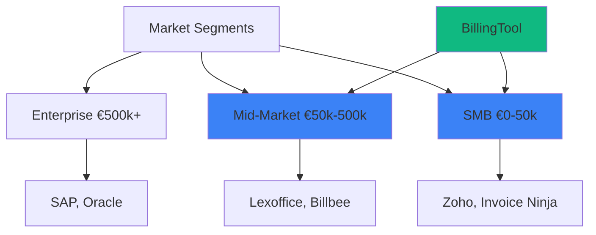
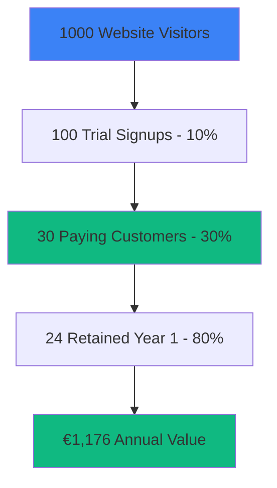

# Monetization Strategy: BillingTool

## Project Valuation

### Market Value Estimation

#### Development Investment Value

**Total Development Effort:**
- Frontend Development: 400-500 hours @ €75/hour = €30,000-37,500
- Backend Development: 300-400 hours @ €75/hour = €22,500-30,000
- Standards Implementation (EN 16931): 150-200 hours @ €100/hour = €15,000-20,000
- Multilingual + RTL: 100-150 hours @ €75/hour = €7,500-11,250
- Accessibility (WCAG 2.1 AA): 80-100 hours @ €75/hour = €6,000-7,500
- Testing & QA: 100-150 hours @ €60/hour = €6,000-9,000
- Documentation: 60-80 hours @ €60/hour = €3,600-4,800

**Total Development Value: €90,600-120,050**

**Conservative Estimate: €100,000**

#### Market Comparable Value

**Similar Commercial Solutions:**
- Basic Invoice Software: €50,000-100,000
- EN 16931 Compliant Systems: €150,000-300,000
- Enterprise Solutions: €500,000+

**BillingTool Market Value: €150,000-250,000**

#### Asset Valuation Components

| Component | Value | Justification |
|-----------|-------|---------------|
| **Source Code** | €80,000-100,000 | Production-ready, well-documented |
| **EN 16931 Implementation** | €30,000-50,000 | Rare, specialized knowledge |
| **Multi-language System** | €15,000-20,000 | 6 languages + RTL support |
| **Documentation** | €10,000-15,000 | Comprehensive, professional |
| **Brand/IP** | €5,000-10,000 | Established codebase |
| **Total Asset Value** | **€140,000-195,000** | |

### Revenue Potential

#### Annual Revenue Projections (Conservative)

**Year 1:**
- SaaS Subscriptions: €50,000-100,000
- Custom Development: €20,000-40,000
- Support Contracts: €10,000-20,000
- **Total: €80,000-160,000**

**Year 2:**
- SaaS Subscriptions: €120,000-200,000
- Custom Development: €40,000-60,000
- Support Contracts: €20,000-30,000
- **Total: €180,000-290,000**

**Year 3:**
- SaaS Subscriptions: €200,000-350,000
- Custom Development: €50,000-80,000
- Support Contracts: €30,000-50,000
- **Total: €280,000-480,000**

**3-Year Revenue Potential: €540,000-930,000**

---

## Competitor Analysis

### Direct Competitors

#### 1. Zoho Invoice
**Pricing:** €0-39/month  
**Strengths:** Brand recognition, integrated ecosystem  
**Weaknesses:** Limited EN 16931 compliance, no RTL support  
**Market Share:** ~15% SMB market  
**Your Advantage:** Better compliance, accessibility, open-source

#### 2. Invoice Ninja
**Pricing:** €0-14/user/month  
**Strengths:** Open-source, feature-rich  
**Weaknesses:** Complex UI, limited EN 16931 support  
**Market Share:** ~5% open-source market  
**Your Advantage:** EN 16931 compliance, better UX, multilingual

#### 3. Billbee
**Pricing:** €19-149/month  
**Strengths:** E-commerce integration  
**Weaknesses:** Germany-focused, expensive  
**Market Share:** ~8% German market  
**Your Advantage:** Multi-language, lower cost, better accessibility

#### 4. Lexoffice
**Pricing:** €7.90-35.90/month  
**Strengths:** German market leader, accounting integration  
**Weaknesses:** Germany-only, proprietary  
**Market Share:** ~20% German SMB market  
**Your Advantage:** International, open-source, customizable

#### 5. Fakturoid
**Pricing:** €10-40/month  
**Strengths:** Simple UI, good support  
**Weaknesses:** Limited to Czech/Slovak markets  
**Market Share:** ~15% Czech market  
**Your Advantage:** 6 languages, EN 16931, accessibility

### Competitive Positioning

**BillingTool Position:** Mid-Market & SMB with premium features at competitive pricing

### Competitive Advantages Summary

| Factor | BillingTool | Competitors |
|--------|-------------|-------------|
| **EN 16931 Compliance** | ✅ 100% | ⚠️ 30-70% |
| **Multi-Language** | ✅ 6 + RTL | ⚠️ 1-3 |
| **Accessibility** | ✅ WCAG 2.1 AA | ❌ Most lack |
| **Open Source** | ✅ Yes | ❌ Mostly proprietary |
| **Customization** | ✅ Full | ❌ Limited |
| **Price** | ✅ Competitive | ⚠️ Varies |
| **Modern Tech** | ✅ React 18 | ⚠️ Legacy often |

---

## Sales Channels & Distribution

### Primary Sales Channels

#### 1. SaaS Platform (Highest Margin)

**Model:** Cloud-hosted subscription service

**Pricing Tiers:**
- **Starter:** €19/month (50 invoices/month)
- **Professional:** €49/month (500 invoices/month)
- **Business:** €99/month (2,000 invoices/month)
- **Enterprise:** €299/month (unlimited + priority support)

**Revenue Potential:**
- 100 customers @ avg €49/month = €4,900/month = €58,800/year
- 500 customers @ avg €49/month = €24,500/month = €294,000/year

**Profit Margin:** 70-80% (after hosting costs)

**Where to Sell:**
- Own website (billingtool.com)
- Product Hunt launch
- Capterra, G2, Software Advice listings
- EU business directories

#### 2. Self-Hosted Licenses

**Model:** One-time license + optional support

**Pricing:**
- **Standard License:** €999 (single company)
- **Multi-Company License:** €2,499 (up to 10 companies)
- **Unlimited License:** €4,999 (unlimited companies)
- **Annual Support:** €499-1,999/year

**Revenue Potential:**
- 50 licenses/year @ avg €1,500 = €75,000/year
- Support contracts @ 60% adoption = €45,000/year

**Profit Margin:** 95%+ (minimal ongoing costs)

**Where to Sell:**
- Own website
- GitHub Sponsors
- CodeCanyon, ThemeForest
- Direct B2B sales

#### 3. Custom Development Services

**Model:** Tailored solutions and integrations

**Pricing:**
- **Custom Features:** €5,000-20,000 per project
- **Integration Development:** €3,000-15,000
- **White-Label Solutions:** €10,000-50,000
- **Enterprise Customization:** €20,000-100,000

**Revenue Potential:**
- 5-10 projects/year = €50,000-150,000/year

**Profit Margin:** 60-70%

**Where to Sell:**
- Direct outreach to enterprises
- Freelancer platforms (Upwork, Toptal)
- Business networks (LinkedIn)
- Industry conferences

#### 4. Marketplace Sales

**Platforms:**

**a) WordPress/WooCommerce Plugin**
- Price: €49-199 (one-time)
- Market: 455 million websites
- Potential: 1,000-5,000 sales/year = €49,000-995,000

**b) Shopify App Store**
- Price: €9.99-29.99/month
- Market: 4.4 million stores
- Potential: 500-2,000 installs = €59,880-719,760/year

**c) Salesforce AppExchange**
- Price: €25-100/user/month
- Market: 150,000+ companies
- Potential: 50-200 customers = €180,000-1,440,000/year

**d) Microsoft AppSource**
- Price: €15-50/user/month
- Market: Large enterprise
- Potential: 100-500 customers = €216,000-3,600,000/year

**Profit Margin:** 60-70% (after platform fees)

#### 5. White-Label Partnerships

**Model:** License to resellers/agencies

**Pricing:**
- **Agency License:** €5,000-10,000/year (rebrand + resell)
- **Revenue Share:** 20-30% of their sales
- **Minimum Commitment:** €10,000/year

**Revenue Potential:**
- 10 partners @ €10,000/year = €100,000/year
- Revenue share: €50,000-100,000/year

**Profit Margin:** 90%+

**Where to Find Partners:**
- Web development agencies
- Accounting firms
- Business consultants
- System integrators

### Distribution Strategy

**Phase 1 (Months 1-6): Foundation**
- Launch SaaS platform
- List on Product Hunt
- Create marketplace presence (Capterra, G2)
- Direct sales to 10-20 early customers

**Phase 2 (Months 7-12): Expansion**
- WordPress/Shopify integrations
- Partner program launch
- Content marketing (SEO, blog)
- 100+ SaaS customers

**Phase 3 (Year 2): Scale**
- Enterprise sales team
- Salesforce/Microsoft integrations
- International expansion
- 500+ SaaS customers

---

## Profit Models & Revenue Streams

### Revenue Stream Breakdown

#### 1. Recurring Revenue (MRR/ARR)

**SaaS Subscriptions:**
- Target: 500 customers by Year 2
- Average: €49/month
- MRR: €24,500
- ARR: €294,000
- **Profit: €205,800 (70% margin)**

**Support Contracts:**
- Target: 50 contracts
- Average: €999/year
- ARR: €49,950
- **Profit: €47,452 (95% margin)**

**Total Recurring Revenue: €343,950/year**  
**Total Recurring Profit: €253,252/year**

#### 2. One-Time Revenue

**License Sales:**
- Target: 50 licenses/year
- Average: €1,500
- Annual: €75,000
- **Profit: €71,250 (95% margin)**

**Custom Development:**
- Target: 8 projects/year
- Average: €12,500
- Annual: €100,000
- **Profit: €65,000 (65% margin)**

**Total One-Time Revenue: €175,000/year**  
**Total One-Time Profit: €136,250/year**

#### 3. Marketplace Revenue

**Plugin Sales:**
- WordPress: 2,000 sales @ €99 = €198,000
- Shopify: 1,000 installs @ €19.99/month = €239,880
- Platform fees (30%): -€131,364
- **Net Profit: €306,516**

### Total Annual Profit (Year 2 Projection)

| Revenue Stream | Annual Revenue | Profit Margin | Annual Profit |
|----------------|----------------|---------------|---------------|
| SaaS | €294,000 | 70% | €205,800 |
| Support | €49,950 | 95% | €47,452 |
| Licenses | €75,000 | 95% | €71,250 |
| Custom Dev | €100,000 | 65% | €65,000 |
| Marketplaces | €437,880 | 70% | €306,516 |
| **Total** | **€956,830** | **73%** | **€696,018** |

---

## Go-to-Market Strategy

### Target Markets (Geographic)

**Primary Markets:**
1. **Germany** - Largest EU economy, strong compliance culture
2. **France** - EN 16931 mandate, large SMB market
3. **Poland** - Growing economy, EU integration
4. **Italy** - E-invoicing mandatory
5. **Netherlands** - Tech-savvy, international business
6. **Spain** - Large SMB market

**Secondary Markets:**
- Belgium, Austria, Czech Republic, Portugal

### Customer Acquisition Strategy

#### Digital Marketing (€2,000-5,000/month)

**SEO & Content:**
- Blog posts on EN 16931 compliance
- Comparison guides
- How-to tutorials
- Case studies
- **Cost:** €1,000/month
- **Expected:** 50-100 leads/month

**Paid Advertising:**
- Google Ads (search)
- LinkedIn Ads (B2B)
- Facebook/Instagram (SMB)
- **Cost:** €1,500-3,000/month
- **Expected:** 30-60 leads/month

**Social Media:**
- LinkedIn company page
- Twitter for updates
- YouTube tutorials
- **Cost:** €500/month
- **Expected:** 20-40 leads/month

#### Direct Sales (€3,000-8,000/month)

**Outbound:**
- Email campaigns to accounting firms
- LinkedIn outreach
- Cold calling (optional)
- **Cost:** €2,000/month (tools + time)
- **Expected:** 10-20 qualified leads/month

**Partnerships:**
- Accounting software integrations
- Business consultant referrals
- Agency partnerships
- **Cost:** €1,000/month
- **Expected:** 15-30 leads/month

#### Inbound Marketing (€1,000-2,000/month)

**Content:**
- Free tools (invoice templates)
- Webinars on compliance
- Email newsletter
- **Cost:** €1,000/month
- **Expected:** 40-80 leads/month

### Conversion Funnel

**Customer Acquisition Cost (CAC):**
- Marketing spend: €5,000/month
- Sales acquired: 30/month
- **CAC: €167 per customer**

**Customer Lifetime Value (LTV):**
- Average subscription: €49/month
- Average retention: 24 months
- **LTV: €1,176**

**LTV:CAC Ratio: 7:1** (Excellent - target is 3:1)

---

## Pricing Strategy

### SaaS Pricing (Recommended)

| Plan | Price/Month | Invoices | Users | Features | Target |
|------|-------------|----------|-------|----------|--------|
| **Starter** | €19 | 50 | 1 | Basic | Freelancers |
| **Professional** | €49 | 500 | 3 | Full | Small Business |
| **Business** | €99 | 2,000 | 10 | Advanced | Growing Companies |
| **Enterprise** | €299 | Unlimited | Unlimited | Premium | Large Organizations |

**Annual Discount:** 20% (2 months free)

### Value-Based Pricing Justification

**Starter (€19/month):**
- Saves €700/month in time (vs manual)
- ROI: 3,684%
- Justification: Minimal features, high value

**Professional (€49/month):**
- Saves €1,400/month
- ROI: 2,857%
- Justification: Full features, perfect for SMBs

**Business (€99/month):**
- Saves €2,800/month
- ROI: 2,828%
- Justification: Advanced features, team collaboration

**Enterprise (€299/month):**
- Saves €5,000+/month
- ROI: 1,672%
- Justification: Unlimited usage, priority support

### Competitive Pricing Comparison

| Provider | Starter | Professional | Business |
|----------|---------|--------------|----------|
| **BillingTool** | €19 | €49 | €99 |
| Zoho Invoice | €0 | €29 | €59 |
| Invoice Ninja | €0 | €14 | €28 |
| Lexoffice | €8 | €16 | €36 |
| Billbee | €19 | €49 | €149 |

**Positioning:** Premium features at mid-market pricing

---

## Implementation Roadmap

### Phase 1: Launch Preparation (Months 1-2)

**Technical:**
- [ ] Set up SaaS infrastructure
- [ ] Implement billing system (Stripe)
- [ ] Create landing page
- [ ] Set up analytics

**Marketing:**
- [ ] Create marketing materials
- [ ] Prepare Product Hunt launch
- [ ] Build email sequences
- [ ] Create demo videos

**Budget:** €5,000-10,000  
**Expected Revenue:** €0-5,000

### Phase 2: Initial Launch (Months 3-6)

**Sales:**
- [ ] Product Hunt launch
- [ ] Direct outreach (50 prospects)
- [ ] List on marketplaces
- [ ] First 20-50 customers

**Marketing:**
- [ ] SEO content (20 articles)
- [ ] Paid ads start
- [ ] Social media presence
- [ ] Webinar series

**Budget:** €15,000-25,000  
**Expected Revenue:** €20,000-40,000

### Phase 3: Growth (Months 7-12)

**Sales:**
- [ ] 100-200 customers
- [ ] Partner program (5-10 partners)
- [ ] Enterprise pilot (3-5 companies)
- [ ] Marketplace integrations

**Marketing:**
- [ ] Scale paid ads
- [ ] Content marketing
- [ ] Case studies
- [ ] Conference presence

**Budget:** €30,000-50,000  
**Expected Revenue:** €80,000-160,000

### Phase 4: Scale (Year 2)

**Sales:**
- [ ] 500+ customers
- [ ] 20+ partners
- [ ] Enterprise sales team
- [ ] International expansion

**Marketing:**
- [ ] Brand building
- [ ] Thought leadership
- [ ] Community building
- [ ] Events/conferences

**Budget:** €60,000-100,000  
**Expected Revenue:** €300,000-500,000

---

## Financial Projections

### 3-Year Financial Forecast

**Year 1:**
- Revenue: €120,000
- Costs: €60,000 (marketing, hosting, support)
- **Profit: €60,000**
- **Margin: 50%**

**Year 2:**
- Revenue: €400,000
- Costs: €160,000
- **Profit: €240,000**
- **Margin: 60%**

**Year 3:**
- Revenue: €800,000
- Costs: €280,000
- **Profit: €520,000**
- **Margin: 65%**

**3-Year Total Profit: €820,000**

### Break-Even Analysis

**Fixed Costs (Monthly):**
- Hosting: €500
- Marketing: €3,000
- Support: €1,000
- Operations: €500
- **Total: €5,000/month**

**Break-Even Customers:**
- Average revenue: €49/month
- Gross margin: 70% = €34.30/customer
- Break-even: €5,000 / €34.30 = **146 customers**

**Timeline to Break-Even: 6-9 months**

---

## Risk Analysis & Mitigation

### Key Risks

| Risk | Probability | Impact | Mitigation |
|------|-------------|--------|------------|
| **Low adoption** | Medium | High | Free tier, strong marketing |
| **Competition** | High | Medium | Unique features, better UX |
| **Technical issues** | Low | High | QA, monitoring, support |
| **Regulatory changes** | Medium | Medium | Stay updated, flexible code |
| **Churn** | Medium | High | Customer success, features |

### Success Factors

✅ **Product-Market Fit:** EN 16931 compliance is mandatory  
✅ **Competitive Advantage:** Accessibility, multilingual, open-source  
✅ **Scalable Model:** SaaS + licenses + services  
✅ **Strong Margins:** 60-80% profit margins  
✅ **Growing Market:** EU e-invoicing mandates expanding  

---

## Conclusion & Recommendations

### Project Value Summary

**Development Value:** €100,000  
**Market Value:** €150,000-250,000  
**3-Year Revenue Potential:** €1.3M-2.0M  
**3-Year Profit Potential:** €800K-1.2M  

### Recommended Strategy

**Primary Focus:**
1. **Launch SaaS Platform** (Highest margin, recurring revenue)
2. **Build Marketplace Presence** (Scalable distribution)
3. **Develop Partner Network** (Leverage existing relationships)

**Secondary Focus:**
4. Self-hosted licenses (passive income)
5. Custom development (high-value projects)

### Next Steps

**Immediate (This Month):**
1. Set up SaaS infrastructure
2. Create pricing page
3. Prepare Product Hunt launch
4. Reach out to 10 potential customers

**Short-term (3 Months):**
1. Launch SaaS platform
2. Acquire first 20 customers
3. List on marketplaces
4. Start content marketing

**Long-term (12 Months):**
1. Reach 200+ customers
2. €150,000+ annual revenue
3. Establish brand presence
4. Expand internationally

### Investment Recommendation

**If Seeking Investment:**
- Valuation: €500,000-1,000,000 (pre-revenue)
- Raise: €100,000-250,000 (10-25% equity)
- Use: Marketing, sales team, infrastructure
- Expected ROI: 5-10x in 3-5 years

**If Bootstrapping:**
- Initial investment: €10,000-20,000
- Timeline to profitability: 6-9 months
- Year 1 profit: €60,000
- Reinvest profits for growth

---

**The BillingTool project has strong commercial potential with multiple revenue streams, competitive advantages, and a growing market. With proper execution, it can generate €800K-1.2M in profit over 3 years.**

**Version:** 1.0.0  
**Date:** January 9, 2026  
**Status:** Ready for Execution ✅
