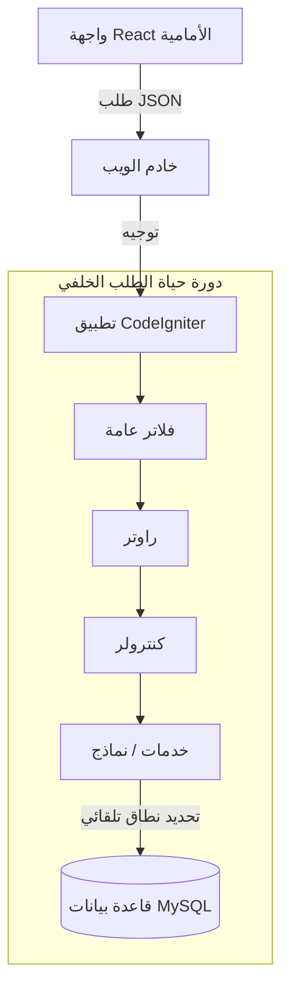

# تدفق البيانات في تطبيق SaaS

هذا المستند يوضح تدفق البيانات عالي المستوى والأنماط المعمارية لتطبيق BillingTool SaaS.

## 1. المعمارية عالية المستوى

*   **الواجهة الأمامية**: React (Vite + TypeScript) تطبيق صفحة واحدة.
*   **الواجهة الخلفية**: PHP (CodeIgniter 4) REST API.
*   **قاعدة البيانات**: MySQL (مخطط مشترك، متعدد المستأجرين).



## 2. دورة حياة الطلب

### المرحلة 1: الدخول والتعريف
1.  **CORS (`CorsFilter`)**: البوابة الأولى. يتحقق من سماح أصل الطلب.
2.  **التعريف الموحد (`UnifiedAuthFilter`)**:
    *   **الطريقة 1 (رمز)**: فك تشفير JWT من ترويسة `Authorization`.
    *   **الطريقة 2 (UUID)**: من مسار URL للمسارات العامة.
    *   **النتيجة**: عند النجاح → يضبط `config('App')->currentTenant`. عند الفشل → `404`.

### المرحلة 2: المصادقة والتفويض
3.  **المصادقة**: يتعرف `UnifiedAuthFilter` على المستخدم عبر JWT.
4.  **فحص RBAC والنطاق (`RbacFilter`)**: يتحقق من صلاحيات المستخدم.

### المرحلة 3: منطق الأعمال واسترداد البيانات
5.  **تنفيذ الكنترولر**: يتم استدعاء طريقة الكنترولر المحددة.
6.  **استعلام قاعدة البيانات (`TenantScope`)**:
    *   **سياق موجود**: يضيف `WHERE tenant_id = <المستأجر_الحالي>`.
    *   **لا سياق**: يضيف `WHERE 1=0` (أمان مغلق عند الفشل).

## 3. إرشادات المطور

### إنشاء نماذج جديدة
دائمًا قم بتمديد `App\Models\BaseModel` لتطبيق `TenantScope` تلقائيًا.

```php
use App\Models\BaseModel;

class MyNewModel extends BaseModel {
    // تعريف الحقول المسموح بها...
}
```

### تجاوز النطاق (استخدم بحذر)
فقط لميزات "المشرف العام" أو منطق المصادقة العام.

```php
$user = $this->userModel->withoutTenant()->find($id);
```
