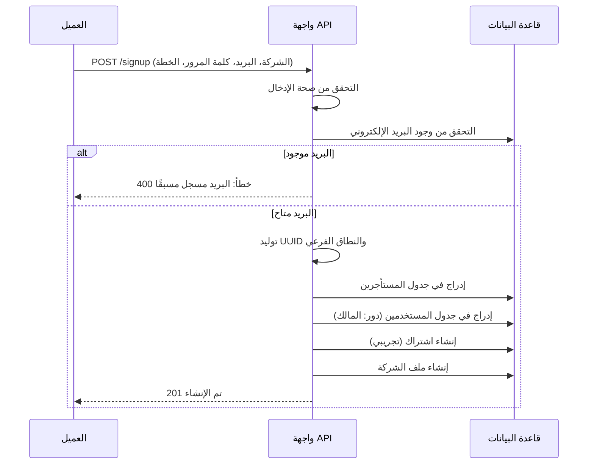

# تدفق مصادقة المستخدم والتسجيل

## 1. نظرة عامة
يوضح هذا المستند تدفق تسجيل المستخدم وإنشاء المستأجر والمصادقة.

## 2. تدفق التسجيل (مستأجر جديد)
**نقطة النهاية**: `POST /onboarding/signup`

### المنطق الرئيسي
*   **إنشاء المستأجر**: يتم إنشاء سجل جديد في `tenants` باستخدام النطاق الفرعي المعقم.
*   **ربط المستخدم**: المستخدم الجديد مرتبط فورًا بـ `tenant_id`.
*   **تعيين الدور**: يتم تعيين دور "مشرف".

## 3. تدفق تسجيل الدخول
**نقطة النهاية**: `POST /api/auth/login`

1.  **تجاوز النطاق**: يستخدم كنترولر `Auth` `withoutTenant()` للبحث عن المستخدم عالميًا بالبريد الإلكتروني.
2.  **بيانات الاعتماد**: يتحقق `password_verify()` من الهاش.
3.  **توليد الرمز**:
    *   **الحمولة**: معرف المستخدم، معرف المستأجر، البريد الإلكتروني، الدور.
    *   **التوقيع**: موقع بـ `JWT_SECRET`.

## 4. المعالجة من جانب العميل
*   **التخزين**: الواجهة الأمامية تخزن الرمز وكائن `user` في `localStorage`.
*   **الطلبات اللاحقة**: يرسل الرمز كترويسة `Authorization`.
