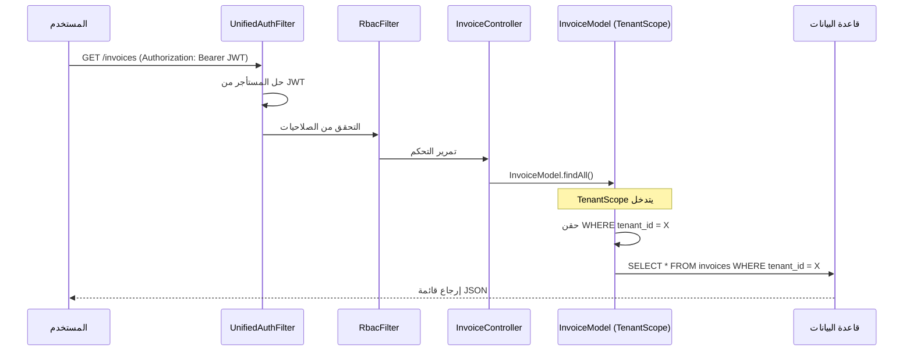

# تدفق بيانات إدارة الفواتير

## 1. نظرة عامة
يوضح هذا المستند تدفق إنشاء الفواتير واسترداد وإدارتها مع التركيز على طبقة الأمان متعددة المستأجرين.

## 2. استرداد الفواتير (قراءة)
**نقطة النهاية**: `GET /invoices`

## 3. إنشاء الفواتير (كتابة)
**نقطة النهاية**: `POST /invoices`

1.  **التحقق**: تُرسل الواجهة الأمامية حمولة JSON.
2.  **الإدراج**: `TenantScope::beforeInsert` يضيف `tenant_id = X` تلقائيًا.
3.  **النتيجة**: الفاتورة مخزنة بـ `tenant_id` الصحيح وغير مرئية للمستأجرين الآخرين.

## 4. ضمانات الأمان
*   **مغلق عند الفشل**: JWT مفقود أو غير صالح → `WHERE 1=0` → نتائج فارغة.
*   **حجب عبر المستأجرين**: `RbacFilter` يمنع المستخدم من مستأجر A من الوصول لبيانات مستأجر B.
