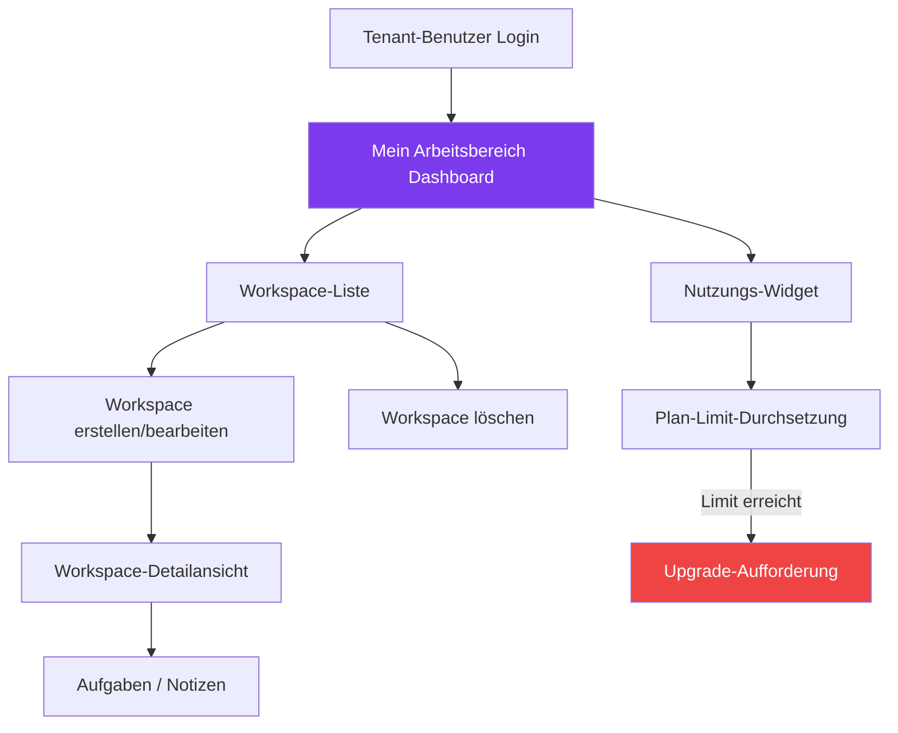

# Modulbericht: Mein Arbeitsbereich
**Status:** ✅ Stabil
**Zuletzt aktualisiert:** März 2026
**Verantwortlich:** Produktteam

---

## 1. Modulübersicht

Das Modul **Mein Arbeitsbereich** bietet jedem Tenant-Benutzer auf der BillingTool-Plattform ein persönliches Produktivitäts-Hub als Projekt- und Aufgabenorganisator, isoliert pro Benutzer.

---

## 2. Teilmodule

| Teilmodul | Beschreibung |
|-----------|--------------|
| **Workspace-Manager** | Persönliche Workspaces erstellen, bearbeiten und löschen |
| **Nutzungs-Widget** | Echtzeit-Kontingentnutzung (Rechnungen, Benutzer, Speicher) anzeigen |
| **Plan-Gate-Controller** | Workspace-Erstellung blockieren, wenn Plan-Limit erreicht |
| **Upgrade-Aufforderung** | Benutzer zur Aktualisierung führen, wenn Limits erreicht |

---

## 3. Funktionen & Status

| Funktionalität | Beschreibung | Status |
| :--- | :--- | :--- |
| **Workspace erstellen** | Benannte Workspaces mit optionaler Beschreibung | ✅ Stabil |
| **Workspace bearbeiten** | Inline-Bearbeitung von Workspace-Name und -Details | ✅ Stabil |
| **Workspace löschen** | Soft-Delete mit Bestätigungsdialog | ✅ Stabil |
| **Workspaces anzeigen** | Paginierte Liste, auf aktuellen Tenant-Benutzer beschränkt | ✅ Stabil |
| **Plan-Gate** | Workspace-Erstellung blockiert, wenn Plan-Limit erreicht | ✅ Stabil |
| **Upgrade-Aufforderung** | Upgrade-CTA bei überschrittenem Workspace-Limit | ✅ Stabil |
| **Nutzungs-Widget** | Live-Anzeige der Ressourcennutzung | ✅ Stabil |
| **Schnellnotizen** | Notizen/Aufgaben an Workspace anhängen | 🟡 In Bearbeitung |
| **Workspace-Freigabe** | Workspace mit anderen Tenant-Benutzern teilen | 🔴 Geplant |

---

## 4. Technische Implementierung

### Backend
- **Controller:** `App\Controllers\WorkspaceController`
- **Modell:** `App\Models\WorkspaceModel`
- **Verwendete Traits:**
  - `TenantScope` — Isoliert alle Workspace-Datensätze pro Tenant
  - `UsageEnforcement` — Prüft Plan-Limits vor der Erstellung
  - `AuditTrait` — Protokolliert alle Erstell-/Bearbeitungs-/Löschaktionen

### API-Endpunkte

| Methode | Endpunkt | Beschreibung |
|---------|----------|--------------|
| `GET` | `/api/v1/workspace` | Alle Workspaces des aktuellen Benutzers auflisten |
| `POST` | `/api/v1/workspace` | Neuen Workspace erstellen |
| `PUT` | `/api/v1/workspace/:id` | Workspace aktualisieren |
| `DELETE` | `/api/v1/workspace/:id` | Workspace löschen |

---

## 5. Plan-Gate-Logik

**Plan-Funktionsmatrix:**

| Plan | Workspace-Zugriff | Max. Workspaces |
|------|------------------|-----------------|
| Starter (Testphase) | ❌ Nein | 0 |
| Starter | ❌ Nein | 0 |
| Professional | ✅ Ja | 5 |
| Business | ✅ Ja | 20 |
| Enterprise | ✅ Ja | Unbegrenzt |

---

## 6. Roadmap

| Quartal | Funktion | Priorität |
|---------|---------|-----------|
| Q2 2026 | Schnellnotizen — Aufgaben/Notizen an Workspaces anhängen | Hoch |
| Q2 2026 | Workspace-Freigabe zwischen Tenant-Benutzern | Mittel |
| Q3 2026 | Workspace-Vorlagen | Mittel |
| Q4 2026 | Kanban-Aufgabenboard | Niedrig |

---

**Version:** 1.0.0
**Status:** ✅ Stabil (Kern), 🟡 In Bearbeitung (Notizen)
