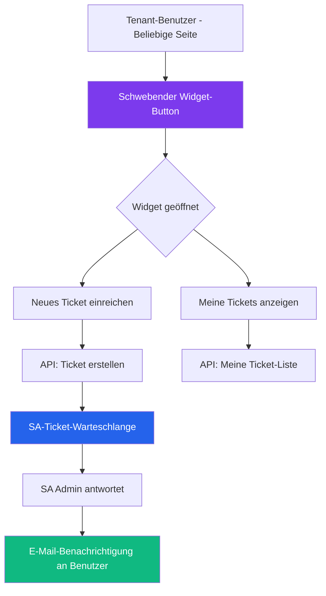

# Modulbericht: Ticketing-Widget
**Status:** ✅ Stabil
**Zuletzt aktualisiert:** März 2026
**Verantwortlich:** Produktteam

---

## 1. Modulübersicht

Das **Ticketing-Widget** ist ein eingebetteter, schwebender Kundensupport-Mechanismus, der auf allen Seiten des BillingTools verfügbar ist. Benutzer können Support-Tickets einreichen und deren Status verfolgen, ohne die App zu verlassen.

---

## 2. Teilmodule

| Teilmodul | Beschreibung |
|-----------|--------------|
| **Widget-Shell** | Schwebender Button + ausklappbares Panel, plattformweit verfügbar |
| **Ticket-Einreichungsformular** | Titel, Beschreibung, Kategorie und Prioritätsfelder |
| **Meine Tickets-Ansicht** | Statusliste der vom aktuellen Benutzer eingereichten Tickets |
| **Screenshot-Aufnahme** | Viewport über `html-to-image` für Fehlerberichte aufnehmen |
| **Anmerkungscanvas** | Pfeile, Rechtecke und Kreise auf aufgenommene Screenshots zeichnen |
| **SA-Ticket-Warteschlange** | Super-Admin-Portal für alle Tickets |
| **E-Mail-Benachrichtigungen** | E-Mail-Alerts bei SA-Antworten oder Statusänderungen |

---

## 3. Funktionen & Status

| Funktionalität | Beschreibung | Status |
| :--- | :--- | :--- |
| **Schwebender Widget-Button** | Persister Button auf allen Tenant-Seiten | ✅ Stabil |
| **Ticket einreichen** | Formular mit Titel, Beschreibung, Kategorie und Priorität | ✅ Stabil |
| **Screenshot-Aufnahme** | Viewport-Screenshot mit einem Klick aufnehmen | ✅ Stabil |
| **Anmerkungswerkzeuge** | Pfeile, Rechtecke, Kreise auf Screenshots zeichnen | ✅ Stabil |
| **Meine Tickets-Liste** | Benutzer sieht Status eigener Tickets im Widget | ✅ Stabil |
| **SA-Ticket-Warteschlange** | Alle Tickets im Super-Admin-Portal | ✅ Stabil |
| **E-Mail bei SA-Antwort** | Benutzer erhält E-Mail bei SA-Antwort | 🟡 In Bearbeitung |
| **Dateianhänge** | Zusätzliche Dateien jenseits von Screenshots anhängen | 🔴 Geplant |

---

## 4. API-Endpunkte

| Methode | Endpunkt | Beschreibung |
|---------|----------|--------------|
| `GET` | `/api/v1/tickets` | Tickets für aktuellen Tenant-Benutzer auflisten |
| `POST` | `/api/v1/tickets` | Neues Ticket einreichen |
| `GET` | `/admin/tickets` | SA: Alle Tickets aller Tenants anzeigen |
| `PUT` | `/admin/tickets/:id/status` | SA: Ticket-Status aktualisieren |

---

## 5. Roadmap

| Quartal | Funktion | Priorität |
|---------|---------|-----------|
| Q2 2026 | E-Mail-Benachrichtigungen bei SA-Antwort | Hoch |
| Q3 2026 | Auto-Eskalation nach SLA-Verletzung | Mittel |
| Q4 2026 | Echtzeit-Chat-Integration im Widget | Niedrig |

---

**Version:** 2.0.0
**Status:** ✅ Stabil (Kern + Screenshots), 🟡 In Bearbeitung (E-Mail)
