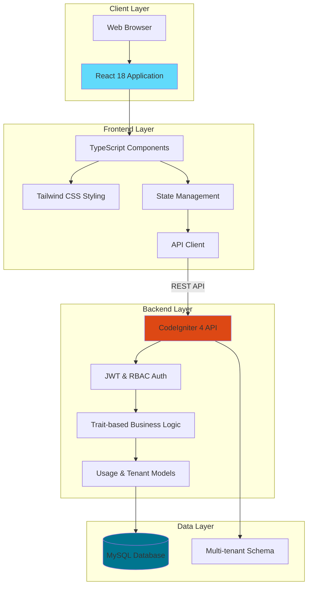
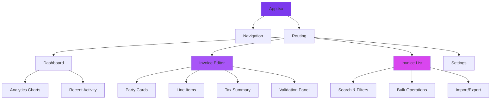
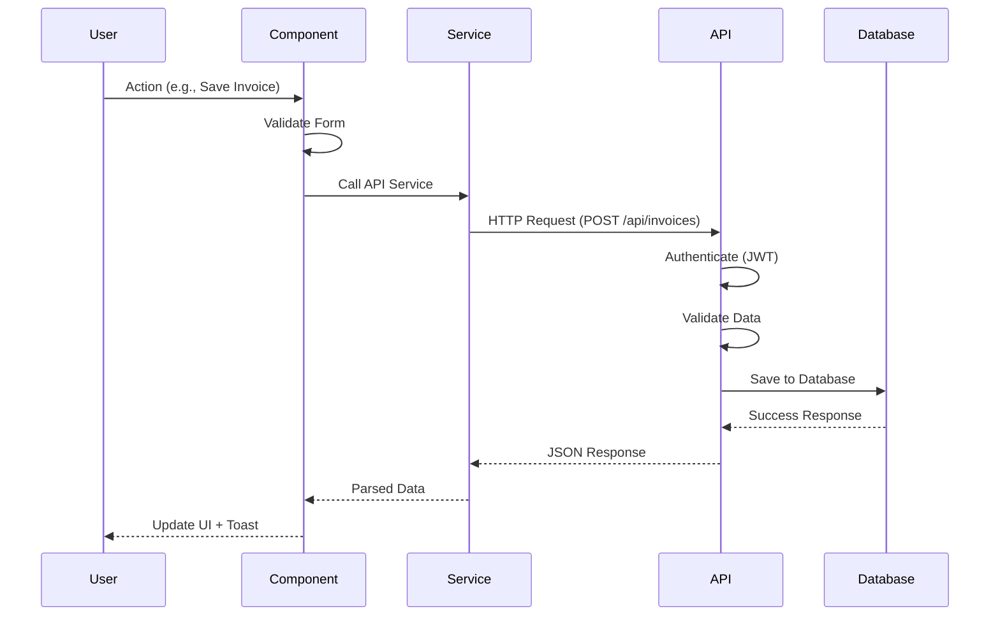
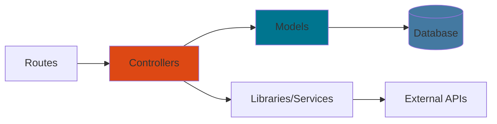
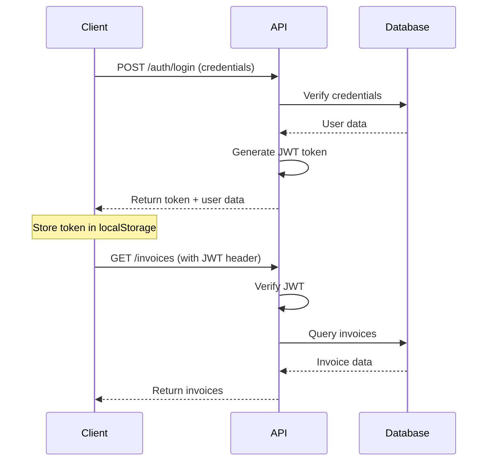
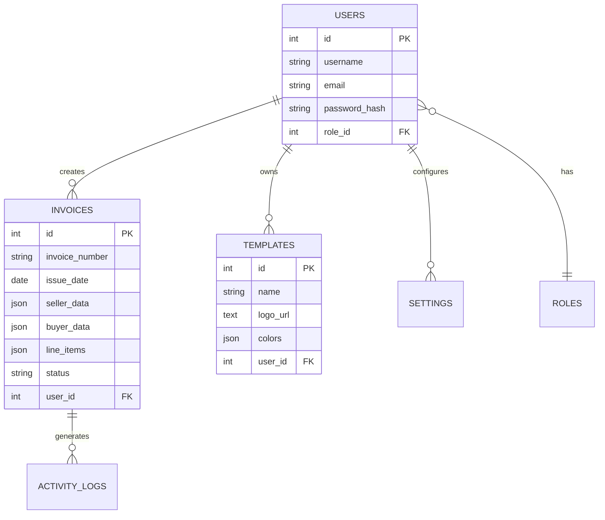
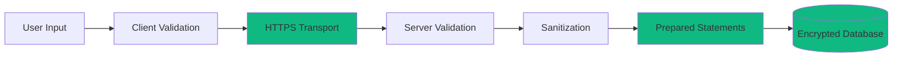
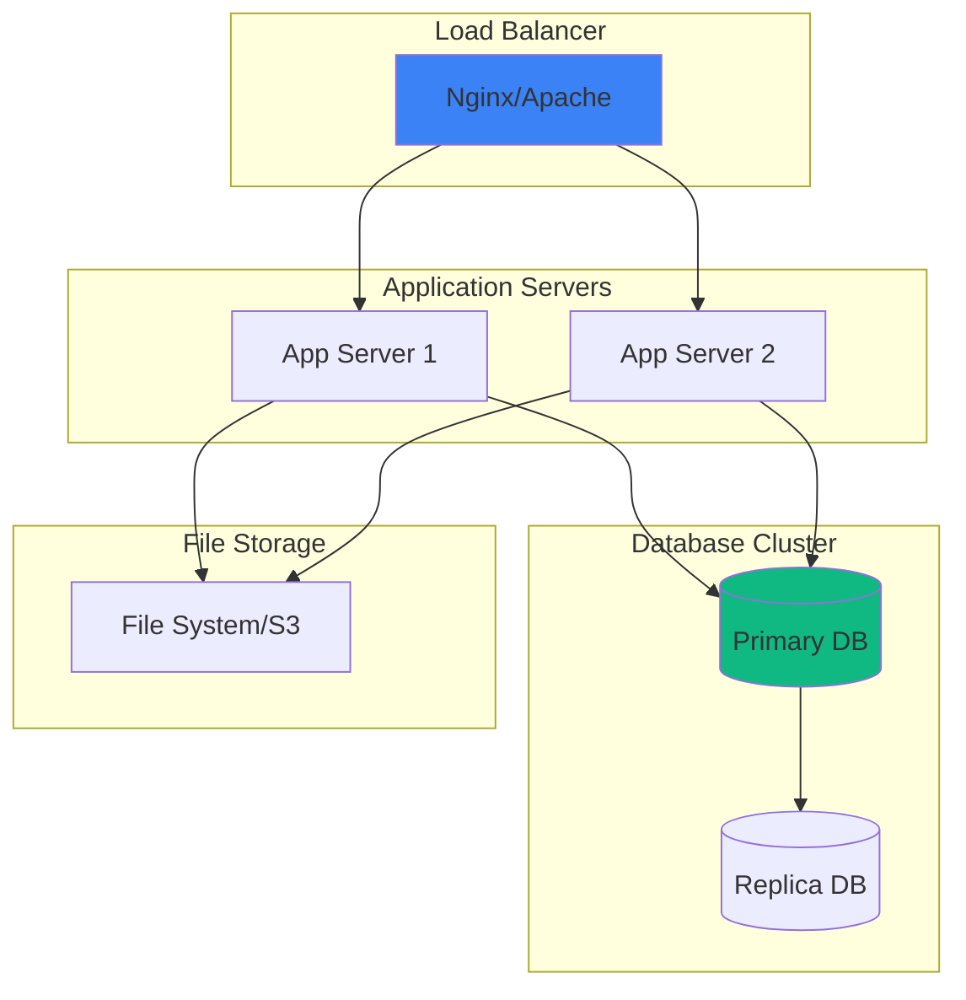
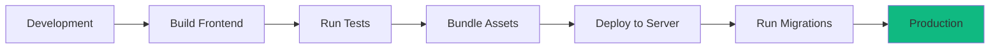

# Technical Architecture: BillingTool

## System Overview

BillingTool is built on a modern, scalable architecture that separates concerns between the frontend presentation layer and backend API layer, ensuring maintainability, security, and performance.

## High-Level Architecture



## SaaS & Multi-Tenancy Architecture

### Subdomain-based Isolation
The platform uses a dynamic subdomain routing system where each tenant accesses the application via `{tenant}.billingtool.com`. 

- **Tenant Identification**: The `TenantFilter` interceptor extracts the subdomain and validates it against the `tenants` table.
- **Fail-Closed Context**: If no valid tenant is identified, the application enters a "restricted mode," blocking all data access.

### Trait-based Modular Logic
To maintain a clean and DRY codebase, core SaaS logic is encapsulated in reusable PHP Traits:

| Trait | Purpose | Implementation Detail |
|-------|---------|-----------------------|
| **TenantScope** | Global Data Isolation | Automatically injects `tenant_id` into all queries and inserts. |
| **UsageEnforcement** | Plan Limits | Blocks resource creation (Invoices, Users) if plan limits are reached. |
| **AuditTrait** | Compliance Logs | Captures all record mutations for a searchable audit trail. |

---

## Frontend Architecture

### Technology Stack

| Component | Technology | Version | Purpose |
|-----------|-----------|---------|---------|
| **Framework** | React | 18.3.1 | UI library |
| **Language** | TypeScript | 5+ | Type safety |
| **Styling** | Tailwind CSS | 4.0 | Utility-first CSS |
| **Build Tool** | Vite | 6.3.5 | Fast development |
| **UI Components** | shadcn/ui | Latest | Accessible components |
| **Icons** | Lucide React | 0.487.0 | Icon system |
| **Forms** | React Hook Form | 7.55.0 | Form management |
| **Charts** | Recharts | 2.15.2 | Data visualization |
| **Notifications** | Sonner | 2.0.3 | Toast messages |

### Component Architecture



### Directory Structure

```
src/
├── App.tsx                      # Main application entry
├── main.tsx                     # React DOM render
├── index.css                    # Global styles
├── components/
│   ├── invoice/                 # Invoice-specific components
│   │   ├── ExportModal.tsx
│   │   ├── LineItemRow.tsx
│   │   ├── PartyCard.tsx
│   │   ├── PreviewModal.tsx
│   │   ├── TaxSummaryPanel.tsx
│   │   ├── TemplateEditor.tsx
│   │   ├── ValidationChip.tsx
│   │   └── ValidationPanel.tsx
│   ├── screens/                 # Full-page views
│   │   ├── Dashboard.tsx
│   │   ├── InvoiceEditor.tsx
│   │   ├── InvoiceList.tsx
│   │   ├── InvoicePreview.tsx
│   │   ├── Login.tsx
│   │   ├── Settings.tsx
│   │   └── TemplateLibrary.tsx
│   ├── ui/                      # shadcn/ui components
│   │   ├── button.tsx
│   │   ├── input.tsx
│   │   ├── dialog.tsx
│   │   └── ...
│   ├── LanguageSwitcher.tsx
│   └── ThemeBuilder.tsx
├── contexts/
│   └── LanguageContext.tsx      # i18n state
├── hooks/
│   └── usePermission.ts         # Custom hooks
├── services/
│   └── api.ts                   # API client
├── types/
│   └── invoice.ts               # TypeScript types
├── utils/
│   ├── i18n.ts                  # Internationalization
│   ├── invoice-calculations.ts # Tax calculations
│   ├── invoice-export.ts        # Export functions
│   ├── invoice-import.ts        # Import functions
│   ├── invoice-pdf-html.ts      # PDF generation
│   └── invoice-validation.ts    # EN 16931 validation
└── translations/
    ├── en.json
    ├── de.json
    ├── ar.json
    └── ...
```

### State Management

**Approach:** React Context API + Local State

```typescript
// Language Context
interface LanguageContextType {
  language: Language;
  setLanguage: (lang: Language) => void;
  t: (key: string) => string;
}

// Local State (React Hook Form)
const { register, handleSubmit, watch } = useForm<Invoice>();
```

### Data Flow



## Backend Architecture

### Technology Stack

| Component | Technology | Version | Purpose |
|-----------|-----------|---------|---------|
| **Framework** | CodeIgniter | 4.x | PHP framework |
| **Language** | PHP | 8.1+ | Server-side logic |
| **Database** | MySQL | 8.0+ | Data persistence |
| **Authentication** | JWT | Latest | Token-based auth |
| **API** | REST | - | HTTP endpoints |
| **AI Integration** | Gemini API | Latest | AI features |

### MVC Architecture



### Directory Structure

```
api/
├── app/
│   ├── Config/
│   │   ├── Routes.php          # API routes
│   │   ├── Database.php        # DB config
│   │   └── ...
│   ├── Controllers/
│   │   ├── Auth.php            # Authentication
│   │   ├── Invoices.php        # Invoice CRUD
│   │   ├── ActivityLog.php     # Audit log access
│   │   └── ...
│   ├── Models/
│   │   ├── BaseModel.php       # Global TenantScope & UsageEnforcement integration
│   │   ├── InvoiceModel.php
│   │   ├── TenantModel.php
│   │   ├── PlanModel.php
│   │   └── ...
│   ├── Traits/
│   │   ├── AuditTrait.php      # Trait-based auditing system
│   │   ├── TenantScope.php     # Multi-tenant query isolation
│   │   └── UsageEnforcement.php # Plan limit enforcement
│   ├── Filters/
│   │   ├── AuthFilter.php      # JWT verification
│   │   └── TenantFilter.php    # Multi-tenancy context setting
│   └── Database/
│       └── Migrations/         # SaaS database schema
├── public/
│   └── index.php               # Entry point
├── writable/
│   ├── logs/                   # Application logs
│   └── uploads/                # File uploads
└── vendor/                     # Composer dependencies
```

### API Endpoints

#### Authentication

```
POST   /api/v1/auth/login       # User login
POST   /api/v1/auth/register    # User registration
POST   /api/v1/auth/refresh     # Refresh token
POST   /api/v1/auth/logout      # Logout
```

#### Invoices

```
GET    /api/v1/invoices         # List invoices
GET    /api/v1/invoices/:id     # Get invoice
POST   /api/v1/invoices         # Create invoice
PUT    /api/v1/invoices/:id     # Update invoice
DELETE /api/v1/invoices/:id     # Delete invoice
POST   /api/v1/invoices/bulk    # Bulk operations
```

#### Templates

```
GET    /api/v1/templates        # List templates
GET    /api/v1/templates/:id    # Get template
POST   /api/v1/templates        # Create template
PUT    /api/v1/templates/:id    # Update template
DELETE /api/v1/templates/:id    # Delete template
```

#### Settings

```
GET    /api/v1/settings         # Get settings
PUT    /api/v1/settings         # Update settings
```

### Authentication Flow



### Database Schema

#### SaaS Infrastructure Tables

**plans**
- id (INT, PK)
- name (VARCHAR)
- slug (VARCHAR)
- limits (JSON) - e.g., `{"invoices": 50, "users": 1}`
- price (DECIMAL)

**tenants**
- id (INT, PK)
- uuid (VARCHAR)
- company_name (VARCHAR)
- subdomain (VARCHAR, Unique)
- plan_id (INT, FK)
- status (ENUM)

#### Core Tables (Multi-tenant)

**users**
- id (INT, PK)
- tenant_id (INT, FK)
- email (VARCHAR)
- password_hash (VARCHAR)
- role (ENUM)

**invoices**
- id (INT, PK)
- tenant_id (INT, FK)
- invoice_number (VARCHAR)
- status (ENUM)
- line_items (JSON)
- totals (JSON)

**templates**
```sql
- id (INT, PK)
- name (VARCHAR)
- logo_url (TEXT)
- header_text (TEXT)
- footer_text (TEXT)
- colors (JSON)
- fonts (JSON)
- user_id (INT, FK)
- created_at (TIMESTAMP)
```

**settings**
```sql
- id (INT, PK)
- company_name (VARCHAR)
- vat_id (VARCHAR)
- address (JSON)
- bank_details (JSON)
- defaults (JSON)
- user_id (INT, FK)
```

### Entity Relationship Diagram



## Security Architecture

### Authentication & Authorization

**JWT (JSON Web Tokens)**
- Token-based authentication
- Secure, stateless sessions
- Configurable expiration
- Refresh token support

**Role-Based Access Control (RBAC)**
- Admin, Manager, User roles
- Permission-based features
- Resource-level authorization

### Security Measures

| Layer | Measure | Implementation |
|-------|---------|----------------|
| **Transport** | HTTPS | SSL/TLS encryption |
| **Authentication** | JWT | Secure token-based auth |
| **Tenant Isolation**| Subdomain Filter | `TenantFilter` validation |
| **Authorization** | RBAC | Role-based permissions |
| **Audit Trail** | Centralized Logs | `AuditTrait` automation |
| **Input** | Validation | Server-side validation |
| **Output** | Sanitization | XSS prevention |
| **Database** | Prepared Statements | SQL injection prevention |
| **CORS** | Configured | Restricted origins |
| **Rate Limiting** | Implemented | DDoS protection |

### Data Protection



## Deployment Architecture

### Production Environment



### Deployment Options

**Option 1: Shared Hosting**
- Single server deployment
- PHP + MySQL
- `.htaccess` configuration
- See [SHARED_HOSTING_DEPLOYMENT.md](../SHARED_HOSTING_DEPLOYMENT.md)

**Option 2: VPS/Cloud**
- Dedicated server
- Nginx/Apache + PHP-FPM
- MySQL/MariaDB
- SSL certificate

**Option 3: Docker**
- Containerized deployment
- Docker Compose
- Scalable architecture
- Easy replication

### Build & Deployment Process



## Performance Optimization

### Frontend Optimizations

- **Code Splitting** - Lazy loading routes
- **Tree Shaking** - Remove unused code
- **Minification** - Compress JS/CSS
- **Caching** - Browser caching strategies
- **CDN** - Static asset delivery
- **Image Optimization** - Compressed images

### Backend Optimizations

- **Database Indexing** - Optimized queries
- **Query Caching** - Reduce DB load
- **Response Compression** - Gzip/Brotli
- **Connection Pooling** - Efficient DB connections
- **Opcode Caching** - PHP OPcache

### Performance Metrics

| Metric | Target | Actual |
|--------|--------|--------|
| **First Contentful Paint** | < 1.5s | ~1.2s |
| **Time to Interactive** | < 3.0s | ~2.5s |
| **API Response Time** | < 200ms | ~150ms |
| **Database Query Time** | < 50ms | ~30ms |

## Scalability Considerations

### Horizontal Scaling

- **Load Balancing** - Distribute traffic across servers
- **Stateless Design** - No server-side sessions
- **Database Replication** - Read replicas for scaling
- **Caching Layer** - Redis/Memcached

### Vertical Scaling

- **Server Resources** - CPU, RAM upgrades
- **Database Optimization** - Query tuning
- **Connection Limits** - Increased capacity

## Monitoring & Logging

### Application Monitoring

- **Error Tracking** - Log errors and exceptions
- **Performance Monitoring** - Track response times
- **User Analytics** - Usage patterns
- **Health Checks** - Server status monitoring

### Logging Strategy

```
writable/logs/
├── error-YYYY-MM-DD.log      # Error logs
├── access-YYYY-MM-DD.log     # Access logs
└── debug-YYYY-MM-DD.log      # Debug logs
```

## Technology Decisions

### Why React 18?

- ✅ Concurrent rendering for better UX
- ✅ Large ecosystem and community
- ✅ Excellent TypeScript support
- ✅ Component reusability

### Why CodeIgniter 4?

- ✅ Lightweight and fast
- ✅ Modern PHP 8.1+ features
- ✅ Built-in security features
- ✅ Easy to learn and maintain

### Why Tailwind CSS v4?

- ✅ Utility-first approach
- ✅ Highly customizable
- ✅ Excellent performance
- ✅ Dark mode support

### Why MySQL?

- ✅ Reliable and proven
- ✅ Excellent performance
- ✅ Wide hosting support
- ✅ JSON column support

## Integration Points

### External Services

- **Email Service** - SMTP for invoice delivery
- **Payment Gateways** - Stripe, PayPal (planned)
- **Cloud Storage** - S3, Google Cloud (optional)
- **AI Services** - Gemini API for smart features

### API Integration

```typescript
// Frontend API Client
const api = {
  baseURL: import.meta.env.VITE_API_URL,
  headers: {
    'Authorization': `Bearer ${token}`,
    'Content-Type': 'application/json'
  }
};
```

## Disaster Recovery

### Backup Strategy

- **Database Backups** - Daily automated backups
- **File Backups** - Regular file system backups
- **Version Control** - Git repository backups
- **Configuration Backups** - Environment configs

### Recovery Plan

1. Restore database from latest backup
2. Restore file system
3. Verify application functionality
4. Resume operations

---

**Next:** Review [Features Overview](FEATURES_OVERVIEW.md) for detailed feature documentation.

**Version:** 2.0.0  
**Last Updated:** January 2026
