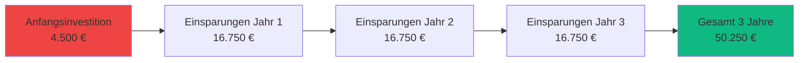

# Geschäftswert: BillingTool

## Zusammenfassung

BillingTool liefert messbaren Geschäftswert durch Automatisierung der Compliance, betriebliche Effizienz und Möglichkeiten zur Marktexpansion. Dieses Dokument quantifiziert den ROI und die Wettbewerbsvorteile der Plattform.

## Problemstellung

### Herausforderungen der Branche

**Regulatorische Komplexität:**
- Europäische E-Rechnungs-Mandate (EN 16931) schaffen Compliance-Belastungen.
- Manuelle Compliance-Prüfungen sind zeitaufwändig und fehleranfällig.
- Nicht-Compliance riskiert Strafen und Geschäftsunterbrechungen.

**Betriebliche Ineffizienz:**
- Manuelle Rechnungserstellung dauert 15-30 Minuten pro Rechnung.
- Dateneingabefehler führen zu Zahlungsverzögerungen.
- Mehrere Systeme erzeugen Datensilos.
- Begrenzte Automatisierungsmöglichkeiten.

**Marktbeschränkungen:**
- Sprachbarrieren schränken die internationale Expansion ein.
- Barrierefreiheitsprobleme schließen potenzielle Kunden aus.
- Altsystemen fehlen moderne Funktionen.
- Hohe Kosten für proprietäre Lösungen.

### Quantifizierte Schmerzpunkte

| Herausforderung | Auswirkung | Geschätzte jährliche Kosten |
|-----------|--------|-------------------|
| **Manuelle Verarbeitung** | 15-30 Min./Rechnung | 15.000–30.000 € |
| **Compliance-Fehler** | 5-10 % Fehlerrate | 5.000–10.000 € |
| **Eingeschränkte Sprachen** | Verlorene Gelegenheiten | 20.000–50.000 € |
| **Systemwartung** | Legacy-Software | 10.000–20.000 € |
| **Gesamt** | - | **50.000–110.000 €** |

## Lösungsansatz

### Wie BillingTool diese Probleme löst

**1. Automatisierte Compliance & Prüfung**
- Echtzeit-Validierung nach EN 16931.
- Zentralisierte Aktivitätsprotokolle über `AuditTrait`.
- Volle Transparenz für Finanzprüfungen.
- Fehlerprävention an der Quelle.

**2. Betriebliche Effizienz**
- 70 % Reduzierung der Zeit für die Rechnungserstellung.
- Einheitliches Dashboard für schnelle Überwachung.
- Vorlagenbasierte Automatisierung.
- **Käufer/Kontakte** füllen Käuferfelder in Sekunden aus.
- **Quick Tour** führt neue Benutzer ohne IT-Support ein.

**3. KI-gestützte Intelligenz**
- **KI-Assistent** (Gemini) erstellt Rechnungsentwürfe aus natürlicher Sprache.
- Compliance-Beratung und Anomalieerkennung.
- KI-Historienmodul verfolgt alle KI-Interaktionen pro Mandant.
- Funktionsbeschränkung auf Pro+-Pläne zur Monetarisierung.

**4. SaaS-Skalierbarkeit & Mehrmandantenfähigkeit**
- Dynamischer, subdomainbasierter Zugriff für jeden Kunden.
- Kein Infrastrukturaufwand für den Endbenutzer.
- Harte Nutzungslimits zur Gewährleistung der Plattformstabilität.
- **Quick Access** bietet sofortige, reibungslose Testbereitstellung.
- Sicherheit auf Unternehmensebene durch Fail-Closed-Isolierung.

**5. Kontrolle für Plattformbetreiber (Super-Admin)**
- **Super-Admin-Portal** — volle Sichtbarkeit aller Mandanten, Abrechnungen und Nutzung.
- **SA-Pakete** — Verwaltung von Plänen mit `is_trailing`- und `is_public`-Flags.
- **SA-Tickets** — zentralisierte Support-Warteschlange aus dem Ticketing-Widget.
- **Admin-Wiki** — Live-Dokumentations-Engine für interne Schulungen.

**6. Marktexpansion**
- 6 Sprachen mit RTL-Unterstützung.
- Multi-Währungs-Fähigkeit.
- Einhaltung internationaler Standards.
- Barrierefrei für alle Benutzer.

**7. Kostenreduzierung**
- Open-Source-Grundlage.
- Selbstgehostete Option.
- Keine Gebühren pro Rechnung.
- Skalierbare Architektur.

## Return on Investment (ROI)

### Analyse der Kosteneinsparungen

#### Zeiteinsparung

**Vor BillingTool:**
- Durchschnittliche Zeit pro Rechnung: 20 Minuten
- Monatliche Rechnungen: 100
- Gesamte monatliche Stunden: 33,3 Stunden
- Jährliche Kosten (30 €/Stunde): 12.000 €

**Nach BillingTool:**
- Durchschnittliche Zeit pro Rechnung: 6 Minuten (70 % Reduzierung)
- Monatliche Rechnungen: 100
- Gesamte monatliche Stunden: 10 Stunden
- Jährliche Kosten (30 €/Stunde): 3.600 €

**Jährliche Einsparung: 8.400 €**

#### Fehlerminimierung

**Vor BillingTool:**
- Fehlerrate: 8 %
- Korrekturbedürftige Rechnungen: 96/Jahr
- Zeit pro Korrektur: 30 Minuten
- Jährliche Kosten: 1.440 €

**Nach BillingTool:**
- Fehlerrate: 0,5 %
- Korrekturbedürftige Rechnungen: 6/Jahr
- Zeit pro Korrektur: 30 Minuten
- Jährliche Kosten: 90 €

**Jährliche Einsparung: 1.350 €**

#### Compliance-Kosten

**Vor BillingTool:**
- Manuelle Validierung: 10 Min./Rechnung
- Compliance-Prüfung: 5.000 €/Jahr
- Strafenrisiko: 2.000 €/Jahr (Durchschnitt)

**Nach BillingTool:**
- Automatisierte Validierung: 0 Min.
- Compliance-Prüfung: 0 €
- Sichtbarkeit des Audit-Trails: 100 %
- Strafenrisiko: 0 € (100 % konform)

**Jährliche Einsparung: 7.000 €**

### Jährliche Gesamteinsparungen

| Kategorie | Jährliche Einsparungen |
|----------|---------------|
| Zeiteinsparung | 8.400 € |
| Fehlerreduzierung | 1.350 € |
| Compliance-Kosten | 7.000 € |
| **Gesamt** | **16.750 €** |

### ROI-Berechnung

**Implementierungskosten:**
- Einrichtung und Konfiguration: 2.000 €
- Schulung: 1.000 €
- Anpassung: 1.500 €
- **Gesamte Anfangsinvestition: 4.500 €**

**ROI-Kennzahlen:**
- **Amortisationszeit:** 3,2 Monate
- **ROI im ersten Jahr:** 272 %
- **ROI über drei Jahre:** 1.017 %

## Zielmarkt & Anwendungsfälle

### Primäre Zielmärkte

**1. Kleine und mittlere Unternehmen (KMU)**
- 10-500 Mitarbeiter
- 50-1.000 Rechnungen/Monat
- In der EU ansässig oder Handel in der EU
- Benötigen Compliance ohne Enterprise-Kosten

**2. Steuerberatungskanzleien**
- Mehrere Mandanten
- Hohes Rechnungsvolumen
- Compliance-Expertise erforderlich
- Mehrsprachigkeitsbedarf

**3. Internationale Unternehmen**
- Grenzüberschreitende Geschäfte
- Multi-Währungs-Anforderungen
- Mehrere Sprachmärkte
- Einhaltung regulatorischer Vorschriften

**4. SaaS-Unternehmen**
- Abonnement-Abrechnung
- Automatisierte Rechnungsstellung
- API-Integrationsbedarf
- Skalierbarkeitsanforderungen

## Wettbewerbsvorteile

### vs. Kommerzielle Lösungen

| Vorteil | BillingTool | Kommerzielle Software |
|-----------|-------------|---------------------|
| **Kosten** | Open-Source, selbstgehostet | 50–200 €/Monat |
| **Anpassung** | Voller Quellzugriff | Begrenzt/teuer |
| **Sprachen** | 6 mit RTL | Typischerweise 2-3 |
| **Barrierefreiheit** | WCAG 2.1 AA | Oft mangelhaft |
| **Vendor Lock-in** | Keine | Hoch |
| **Datenkontrolle** | Vollständig | Eingeschränkt |

### Einzigartige Differenzierungsmerkmale

**1. Echte EN 16931 Konformität**
- Nicht nur Export-Fähigkeit, sondern Echtzeit-Validierung.
- Vollständige Standard-Implementierung.

**2. KI-gestützte Arbeitsabläufe (Gemini)**
- Rechnungsentwurf aus natürlicher Sprache.
- Anomalieerkennung und Compliance-Vorschläge.

**3. Vollständiges SaaS-Management (Super-Admin-Portal)**
- Kontrolle über jeden Mandanten ohne Serverzugriff.
- Paketverwaltung mit Trailing-Plänen.

**4. Reibungslose Testversion (Quick Access)**
- Keine E-Mail-Verifizierung für Tests erforderlich.
- Automatische Bereitstellung eines funktionsfähigen Mandanten in Sekunden.

## Fazit

BillingTool liefert außergewöhnlichen Geschäftswert durch:

✅ **Sofortiger ROI** - 3,2 Monate Amortisationszeit  
✅ **Erhebliche Einsparungen** - 16.750 €+ jährlich  
✅ **Marktexpansion** - 6 Sprachmärkte  
✅ **Risikoreduzierung** - 100 % Compliance mit vollem Audit-Trail  
✅ **KI-Vorteil** - Gemini-gestützte Entwurfserstellung und Analyse  
✅ **SaaS-Ready** - Super-Admin-Portal, Quick Access, Ticketing-Widget  
✅ **Zukunftssicher** - Moderne, skalierbare Architektur  

---

**Nächster Schritt:** Lesen Sie die [Implementierungshöhepunkte](IMPLEMENTATION_HIGHLIGHTS.md) für technische Details.

**Version:** 2.0.0  
**Zuletzt aktualisiert:** Januar 2026
