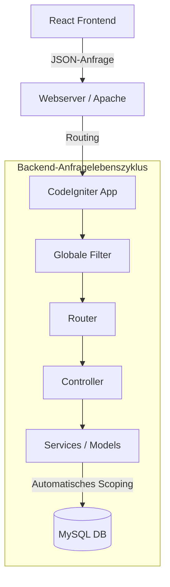

# Datenflussdokumentation der SaaS-Anwendung

Dieses Dokument beschreibt den übergeordneten Datenfluss und die Architekturmuster der Billing Tool SaaS-Anwendung.

## 1. Hochrangige Architektur

*   **Frontend**: React (Vite + TypeScript) SPA.
*   **Backend**: PHP (CodeIgniter 4) REST API.
*   **Datenbank**: MySQL (Gemeinsames Schema, Multi-Tenant).



## 2. Anfragelebenszyklus

Jede API-Anfrage durchläuft eine strenge Pipeline von Filtern.

### Phase 1: Eingang & Identifizierung
1.  **CORS (`CorsFilter`)**: Erster Gatekeeper. Prüft, ob die Anfragenherkunft erlaubt ist.
2.  **Unified-Identifizierung (`UnifiedAuthFilter`)**:
    *   **Methode 1 (Token)**: Dekodiert JWT aus `Authorization`-Header → `tenant_id`.
    *   **Methode 2 (UUID)**: Aus URL-Pfad (`/portal/<uuid>/...`) für öffentliche Routen.
    *   **Methode 3 (Subdomain)**: Prüft den Host-Header.
    *   **Ergebnis**: Bei Erfolg → setzt `config('App')->currentTenant`. Bei Fehler → `404`.

### Phase 2: Authentifizierung & Autorisierung
3.  **Authentifizierung**: `UnifiedAuthFilter` identifiziert den Benutzer via JWT.
4.  **RBAC & Scope-Prüfung (`RbacFilter`)**:
    *   Prüft Benutzerberechtigungen (z. B. `invoices.read`).
    *   Bei Mismatch oder fehlenden Rechten → `403 Verboten`.

### Phase 3: Geschäftslogik & Datenabruf
5.  **Controller-Ausführung**: Die spezifische Controller-Methode wird aufgerufen.
6.  **Datenbankabfrage (`TenantScope`)**:
    *   **Kontext gefunden**: Fügt `WHERE tenant_id = <aktueller_tenant>` hinzu.
    *   **Kein Kontext**: Fügt `WHERE 1=0` hinzu (**Fail-Closed-Sicherheit**).

## 3. Wichtige Datenflüsse

### A. Benutzer-Login
*   **Route**: `POST /api/auth/login`
*   **Tenant-Filter**: Wird umgangen (System kennt noch keinen Tenant).
*   **Antwort**: Gibt JWT-Token + `user.tenant_id` zurück.

### B. Rechnungen abrufen
*   **Route**: `GET /invoices`
*   **Client**: Sendet JWT.
*   **Tenant-Filter**: Löst auf und setzt `currentTenant`.
*   **Model**: Fügt automatisch `WHERE tenant_id = X` hinzu.

## 4. Entwicklerrichtlinien

### Neue Models erstellen
Immer `App\Models\BaseModel` erweitern, um `TenantScope` automatisch anzuwenden.

```php
use App\Models\BaseModel;

class MeinModel extends BaseModel {
    // erlaubte Felder definieren...
}
```

### Scope umgehen (nur bei Bedarf)
Nur für Super-Admin-Funktionen oder globale Authentifizierungslogik verwenden.

```php
$user = $this->userModel->withoutTenant()->find($id);
```
