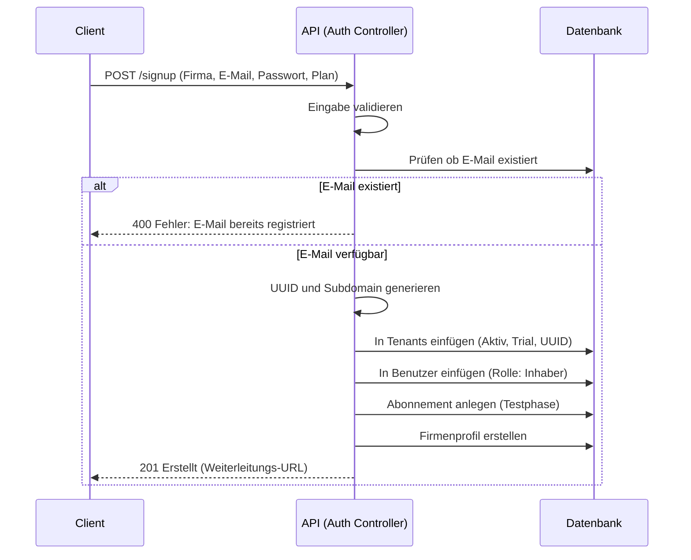

# Authentifizierungs- & Onboarding-Datenfluss

## 1. Überblick
Dieses Dokument beschreibt den Ablauf für Benutzerregistrierung, Tenant-Erstellung und Authentifizierung.

## 2. Registrierungsablauf (Neuer Tenant)
**Endpunkt**: `POST /onboarding/signup`
**Controller**: `Onboarding::signup`

### Schlüssellogik
*   **Tenant-Erstellung**: Ein neuer Eintrag in `tenants` wird mit der bereinigten Subdomain erstellt.
*   **Benutzerzuordnung**: Der neue Benutzer wird sofort an diese `tenant_id` gebunden.
*   **Rollenzuweisung**: Eine „Admin"-Rolle wird für den gewählten Unternehmenstyp zugewiesen.
*   **Quick-Access-Flow**: Vereinfachtes Onboarding per OTP — Benutzer werden automatisch dem „Trailing"-Plan zugewiesen.

## 3. Anmeldeablauf
**Endpunkt**: `POST /api/auth/login`
**Controller**: `Auth::login`

1.  **Scope-Umgehung**: Der `Auth`-Controller nutzt `withoutTenant()`, um den Benutzer global per E-Mail zu suchen.
2.  **Anmeldedaten**: `password_verify()` prüft den Hash.
3.  **Tenant-Abfrage**: Das System prüft, ob der Tenant des Benutzers existiert und aktiv ist.
4.  **Token-Generierung**:
    *   **Payload**: User-ID, Tenant-ID, E-Mail, Rolle.
    *   **Signierung**: Mit `JWT_SECRET` signiert.

## 4. Client-seitige Verarbeitung
*   **Speicherung**: Das Frontend speichert Token und `user`-Objekt in `localStorage`.
*   **Folgende Anfragen**: Die Logik in `api.ts` sendet das Token als `Authorization`-Header.
