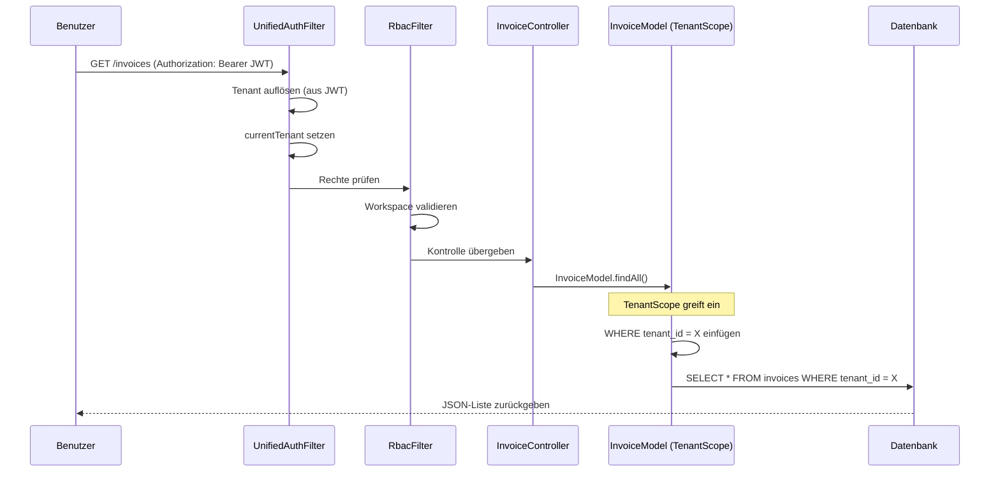

# Datenfluss der Rechnungsverwaltung

## 1. Überblick
Dieses Dokument beschreibt den Ablauf für die Erstellung, den Abruf und die Verwaltung von Rechnungen mit Schwerpunkt auf der Multi-Tenant-Sicherheitsschicht.

## 2. Rechnungen abrufen (Lesen)
**Endpunkt**: `GET /invoices`
**Controller**: `InvoiceController::index`

## 3. Rechnungen erstellen (Schreiben)
**Endpunkt**: `POST /invoices`
**Controller**: `InvoiceController::create`

1.  **Validierung**: Frontend sendet JSON-Payload.
2.  **Kontext**:
    *   **Tenant**: Durch `UnifiedAuthFilter` ermittelt (aus JWT).
    *   **Benutzer**: Durch JWT-Token ermittelt.
3.  **Einfügen**:
    *   `InvoiceModel` erweitert `BaseModel`.
    *   `TenantScope::beforeInsert` fügt automatisch `tenant_id = X` hinzu.
4.  **Ergebnis**: Die Rechnung wird mit der korrekten `tenant_id` gespeichert und ist für andere Tenants unsichtbar.

## 4. Sicherheitsgarantien
*   **Fail-Closed**: Fehlendes oder ungültiges JWT → `TenantScope` erzwingt `WHERE 1=0` → leere Ergebnisse.
*   **Cross-Tenant-Blockierung**: `RbacFilter` verhindert, dass ein Benutzer aus Tenant A mit seinem Token auf Daten von Tenant B zugreift.
