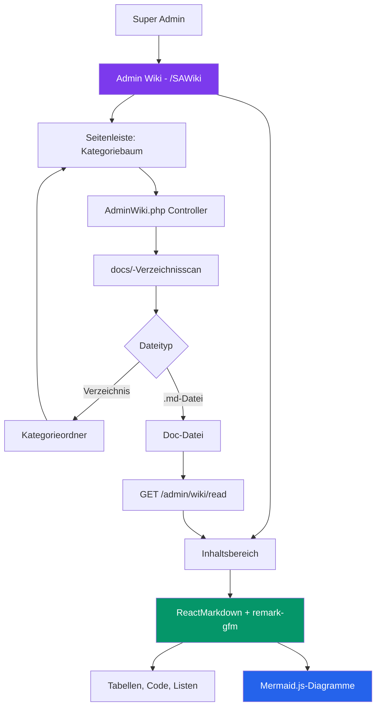

# Modulbericht: Admin-Wiki
**Status:** ✅ Stabil
**Zuletzt aktualisiert:** März 2026
**Verantwortlich:** Produktteam

---

## 1. Modulübersicht

Das **Admin-Wiki** ist ein Live-Dokumentationssystem im Portal, das ausschließlich Super-Admins zur Verfügung steht. Es liest und rendert dynamisch alle `docs/*.md`-Dateien vom Dateisystem zur Anfragezeit und stellt ein kategorisiertes, durchsuchbares Dokumentations-Hub direkt im Super-Admin-Portal bereit — ohne separates Deployment oder Rebuild.

---

## 2. Teilmodule

| Teilmodul | Beschreibung |
|-----------|--------------|
| **Seitenbaum** | Automatisch generierter Kategoriebaum aus der `docs/`-Verzeichnisstruktur |
| **Live-Suche** | Echtzeit-Dateinamenfilter in der Seitenleiste |
| **Markdown-Renderer** | Vollständiges GFM-Rendering via `react-markdown` + `remark-gfm` |
| **Mermaid-Diagramm-Engine** | Rendert `sequenceDiagram`, `graph`, `erDiagram`, `flowchart`-Blöcke als SVGs |
| **Interner Link-Navigator** | Relative `.md`-Links navigieren innerhalb des Wikis |
| **Code-Syntax-Highlighter** | Code-Blöcke mit sprachspezifischem Styling |

---

## 3. Funktionen & Status

| Funktionalität | Beschreibung | Status |
| :--- | :--- | :--- |
| **Verzeichnisbaum-API** | Backend scannt `docs/` und gibt kategorisierten Dateibaum zurück | ✅ Stabil |
| **Markdown-Inhalts-API** | Liest und gibt rohen `.md`-Dateiinhalt zurück | ✅ Stabil |
| **Pfadsicherung** | Verhindert Directory-Traversal-Angriffe | ✅ Stabil |
| **Seitenleistennavigation** | Einklappbarer Ordnerbaum, nach Kategorie auto-erweitert | ✅ Stabil |
| **Live-Suche** | Dokumente nach Dateinamen in Echtzeit filtern | ✅ Stabil |
| **Tabellenrendering** | GFM-Pipe-Tabellen als gestaltete HTML-Tabellen | ✅ Stabil |
| **Mermaid-Diagramme** | sequence, graph, flowchart, erDiagram → SVG | ✅ Stabil |
| **Interne Link-Navigation** | Relative `.md`-Links lösen Wiki-Navigation aus | ✅ Stabil |
| **Mehrsprachige Docs** | Docs in EN/DE/AR basierend auf Sprachauswahl | ✅ Stabil |
| **PDF-Export** | Aktuelle Seite als PDF exportieren | ✅ Stabil |
| **Volltext-Suche** | Suche im Dokumentinhalt | 🔴 Geplant |

---

## 4. Technische Implementierung

### Backend
- **Controller:** `App\Controllers\AdminWiki`
- **Schlüsselmethoden:**
  - `index()` — Scannt `docs/{lang}/`-Verzeichnis
  - `read()` — Gibt Dateiinhalt für gewählte Sprache zurück
- **Sicherheit:** Pfad wird bereinigt; Traversal-Versuche werden abgelehnt

### Frontend
- **Komponente:** `src/components/screens/Admin/SAWiki.tsx`
- **Sprache:** Nutzt `useLanguage()` aus `LanguageContext`
- **API-Service:** `adminWikiService.getTree(lang)` / `getContent(path, lang)`

---

## 5. Sprachunterstützung

Das Wiki unterstützt drei Sprachen:

| Sprache | Code | Verzeichnis | Status |
|---------|------|-------------|--------|
| Englisch | `en` | `docs/en/` | ✅ Vollständig |
| Deutsch | `de` | `docs/de/` | ✅ Vollständig |
| Arabisch | `ar` | `docs/ar/` | ✅ Vollständig |

---

**Version:** 1.1.0
**Zuletzt aktualisiert:** März 2026
**Status:** ✅ Stabil
