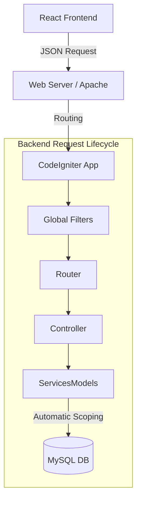

# SaaS Application Data Flow & Architecture

This document outlines the high-level data flow and architectural patterns of the Billing Tool SaaS application. It is designed to help developers understand how requests are processed, secured, and isolated in a multi-tenant environment.

## 1. High-Level Architecture
The application follows a standard **Client-Server** architecture:

*   **Frontend**: React (Vite + TypeScript) SPA.
*   **Backend**: PHP (CodeIgniter 4) REST API.
*   **Database**: MySQL (Shared Schema, Multi-Tenant).



## 2. Request Lifecycle: "The Life of a Request"

Every API request goes through a strict pipeline of filters to ensure security and tenant isolation before reaching the business logic.

### Phase 1: Entry & Identification
1.  **CORS (`CorsFilter`)**: The first gatekeeper. Checks if the request origin is allowed.
2.  **Tenant Resolution (`TenantFilter`)**:
    *   **Method 1 (Token)**: Decodes JWT from `Authorization` header to find `tenant_id`.
    *   **Method 2 (UUID)**: Parsed from URL path (`/portal/<uuid>/...`) for public routes.
    *   **Method 3 (Header)**: Checks `X-Tenant-ID` (Optional override).
    *   **Result**: 
        *   If valid: Sets `config('App')->currentTenant`.
        *   If invalid: Returns `404 Tenant Not Found` (unless it's a global auth route).

### Phase 2: Authentication & Authorization
3.  **Authentication (`HybridAuthFilter` / `AuthFilter`)**:
    *   **Input**: `Authorization: Bearer <JWT>` header.
    *   **Action**: Decodes the JWT to identify the `User ID`.
4.  **RBAC & Scope Check (`RbacFilter`)**:
    *   **Permission Check**: Does the user have the required right (e.g., `invoices.read`)?
    *   **Tenant Guard (Critical)**: Does the authenticated user's `tenant_id` match the `currentTenant->id` resolved in Phase 1?
    *   **Result**: If mismatch -> `403 Forbidden`. This prevents cross-tenant access even with a valid token.

### Phase 3: Business Logic & Data Retrieval
5.  **Controller Execution**: The specific controller method (e.g., `InvoiceController::index`) is called.
6.  **Database Query (`TenantScope`)**:
    *   When the controller calls a Model (e.g., `InvoiceModel::findAll()`):
    *   **Automatic Injection**: The `TenantScope` trait intercepts the query instructions.
    *   **Logic**:
        *   **Context Found**: Adds `WHERE tenant_id = <currentTenant->id>`.
        *   **No Context**: Adds `WHERE 1=0` (**Fail-Closed Security**).
    *   This ensures developers cannot accidentally write queries that leak data across tenants.

## 3. Key Data Flows

### A. User Login (Global Flow)
*   **Route**: `POST /api/auth/login`
*   **Tenant Filter**: Bypassed (System doesn't know tenant yet).
*   **Auth Controller**: 
    *   Uses `withoutTenant()` bypass scope.
    *   Looks up user by Email globally.
    *   Verifies Password.
*   **Response**: Returns JWT Token + `user.tenant_id`.

### B. Fetching Invoices (Scoped Flow)
*   **Route**: `GET /invoices`
*   **Client**: Sends JWT + `X-Tenant-ID: <subdomain>`.
*   **Tenant Filter**: Resolves and sets `currentTenant`.
*   **Rbac Filter**: Verifies User ID belongs to `currentTenant`.
*   **Controller**: Calls `InvoiceModel->findAll()`.
*   **Model**: Auto-appends `WHERE tenant_id = 5`.
*   **Result**: User sees *only* their invoices.

## 4. Developer Guidelines

### Creating New Models
Always extend `App\Models\BaseModel` instead of CodeIgniter's `Model`. This ensures `TenantScope` is automatically applied.

```php
use App\Models\BaseModel;

class MyNewModel extends BaseModel {
    // defined allowed fields...
}
```

### Bypassing Scope (Use with Caution)
Only use this for "Super Admin" features or global authentication logic.

```php
$user = $this->userModel->withoutTenant()->find($id);
```

### Frontend API Calls
Always use the helper service `src/services/api.ts`. It automatically injects the `X-Tenant-ID` header based on the logged-in user's context.

```typescript
// Do this:
await invoiceService.getAll();

// Avoid raw axios calls unless necessary:
axios.get('/invoices'); // MISSING tenant context!
```
