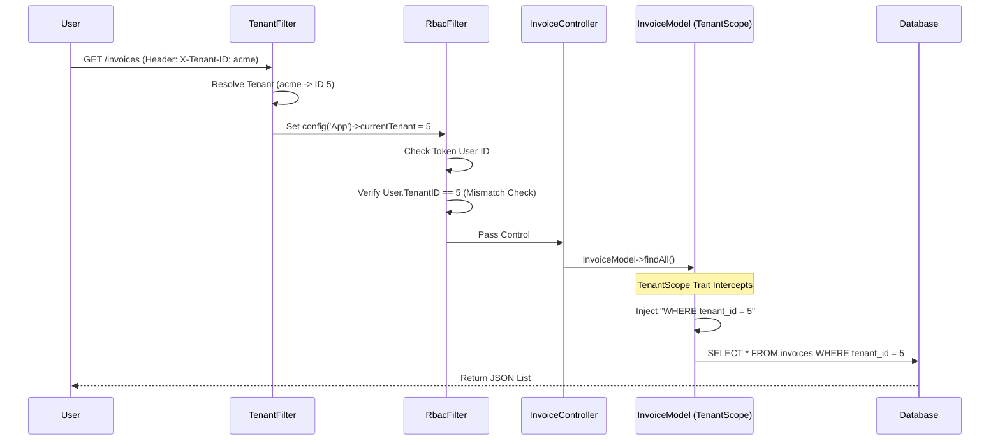

# Invoice Management Data Flow

## 1. Overview
This document details the flow for creating, retrieving, and managing invoices, emphasizing the Multi-Tenant security layer.

## 2. Fetching Invoices (Read)
**Endpoint**: `GET /invoices`
**Controller**: `InvoiceController::index`

## 3. Creating Invoices (Write)
**Endpoint**: `POST /invoices`
**Controller**: `InvoiceController::create`

1.  **Validation**: Frontend sends JSON payload.
2.  **Context**: 
    *   **Tenant**: Determined by `TenantFilter` (Header).
    *   **User**: Determined by JWT Token (`created_by`).
3.  **Insertion**:
    *   `InvoiceModel` extends `BaseModel`.
    *   `TenantScope::beforeInsert` automatically adds `tenant_id = 5` to the data payload before it hits the database.
4.  **Result**: The invoice is physically stored with the correct `tenant_id`, making it invisible to other tenants.

## 4. Security Guarantees
*   **Fail-Closed**: If the `X-Tenant-ID` header is missing or invalid, `TenantScope` forces a `WHERE 1=0` query, returning empty results instead of leaking data.
*   **Cross-Tenant Blocking**: `RbacFilter` prevents a valid user from Tenant A using their token to request data from Tenant B's domain.
