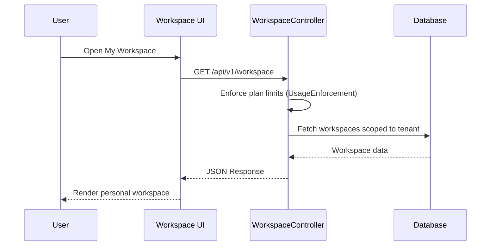

# Features Overview: BillingTool

## Introduction

BillingTool provides a comprehensive suite of features for creating, managing, and exporting EN 16931-compliant invoices. This document details all major features and capabilities.

## Core Features

### 1. SaaS & Multi-Tenancy

#### Subdomain Isolation
- ✅ **Dedicated Subdomains** - Automatic routing via `{tenant}.humpl.org`
- ✅ **Fail-Closed Security** - Strict isolation ensuring zero data leakage between tenants
- ✅ **Dynamic Branding** - Subdomain-specific logos and company profiles

#### Usage Enforcement (Hard Limits)
- ✅ **Resource Capping** - Automatic blocking of record creation if plan limits are reached
- ✅ **Real-time Checks** - Limits verified on the fly for Invoices, Users, and Projects
- ✅ **Upgrade Prompts** - Integrated messaging for hitting usage caps

#### Plan Management
- ✅ **Tiered Subscriptions** - Supportive of Starter, Pro, Business, and Enterprise plans
- ✅ **Feature Gating** - Modular access to advanced tools (e.g., AI Assistant) based on plan

### 2. Invoice Management

#### Party Management

**Seller Information:**
- Company name
- VAT ID (validated format)
- Legal organization ID
- Complete address (street, city, postal code, country)
- Contact email and phone
- Bank details (IBAN, BIC)

**Buyer Information:**
- All seller fields applicable
- Customer-specific details
- Billing address
- Contact information

#### Line Items

**Features:**
- ✅ Add unlimited line items
- ✅ Drag-to-reorder items
- ✅ Inline editing
- ✅ Auto-calculation of totals
- ✅ Tax category per item

**Line Item Fields:**
- Description
- Quantity
- Unit code (UN/ECE Recommendation 20)
- Unit price
- Tax category (S, Z, E, AE, K, G)
- Tax percentage
- Line total (auto-calculated)

### 2. Tax Calculations

#### Supported Tax Categories

| Code | Description | Use Case |
|------|-------------|----------|
| **S** | Standard rate | Normal VAT (e.g., 20%) |
| **Z** | Zero-rated | Exports, books |
| **E** | Exempt | Healthcare, education |
| **AE** | Reverse charge | B2B services |
| **K** | Intra-community | EU cross-border |
| **G** | Free export | Outside EU |

#### Automatic Calculations


**Calculated Fields:**
- Line total = Quantity × Unit price
- Tax amount = Line total × Tax percent
- Line extension amount (sum of all line totals)
- Tax exclusive amount (before tax)
- Tax inclusive amount (with tax)
- Payable amount (final total)

#### Tax Breakdown

- Grouped by tax category and rate
- Taxable amount per category
- Tax amount per category
- Total tax summary
- Displayed in dedicated panel

### 3. EN 16931 Compliance

#### Real-Time Validation

**Validation Levels:**
- ✅ **Valid** - Fully EN 16931 compliant
- ⚠️ **Warning** - Missing optional fields
- ❌ **Error** - Missing required fields

**Validated Elements:**
- Required fields presence
- VAT ID format (country-specific)
- Currency code (ISO 4217)
- Country code (ISO 3166-1)
- Unit code (UN/ECE Rec 20)
- Tax category validity
- Calculation accuracy

#### Validation Panel

**Features:**
- Live validation as you type
- Detailed error messages
- Suggested fixes for each issue
- UBL path references
- Color-coded severity

**Example Validation:**
```
❌ Seller VAT ID is required (BT-31)
   → Add VAT ID in seller information

⚠️ Payment terms not specified (BT-20)
   → Consider adding payment terms
```

### 4. Multi-Format Export

#### PDF Export

**Features:**
- ✅ Professional invoice layout
- ✅ Template styling applied
- ✅ Company logo included
- ✅ Tax breakdown table
- ✅ Payment information
- ✅ Print-optimized

**Generation Method:**
- Advanced HTML-to-PDF generation
- Superior quality and layout control
- Professional black/white business design
- Browser-native print functionality
- Zero external library overhead
- Customizable branding via templates

#### UBL XML Export

**Features:**
- ✅ EN 16931 compliant
- ✅ Proper XML namespaces
- ✅ All required elements
- ✅ Valid XML structure
- ✅ UTF-8 encoding

**XML Structure:**
```xml
<?xml version="1.0" encoding="UTF-8"?>
<Invoice xmlns="urn:oasis:names:specification:ubl:schema:xsd:Invoice-2">
  <ID>INV-2024-001</ID>
  <IssueDate>2024-01-05</IssueDate>
  <AccountingSupplierParty>...</AccountingSupplierParty>
  <AccountingCustomerParty>...</AccountingCustomerParty>
  <InvoiceLine>...</InvoiceLine>
  <LegalMonetaryTotal>...</LegalMonetaryTotal>
</Invoice>
```

#### JSON Export

**Features:**
- ✅ Complete invoice data
- ✅ Structured format
- ✅ Easy to parse
- ✅ All fields preserved
- ✅ Human-readable

#### CSV Export

**Features:**
- ✅ Spreadsheet compatible
- ✅ Headers included
- ✅ Line items in rows
- ✅ Bulk export support
- ✅ Excel/Google Sheets ready

### 5. Multi-Format Import

#### JSON Import

**Supported:**
- Single invoice object
- Array of invoices
- Auto-validation
- Error reporting

**Process:**
1. Upload JSON file
2. Parse and validate
3. Preview imported data
4. Confirm import
5. Add to invoice list

#### CSV Import

**Features:**
- ✅ Line items with metadata
- ✅ Headers required
- ✅ Multi-invoice support
- ✅ Warning for missing columns
- ✅ Template download available

**CSV Format:**
```csv
Invoice Number,Issue Date,Seller Name,Buyer Name,Description,Quantity,Unit Price,Tax %
INV-001,2024-01-05,Acme Corp,Client Ltd,Service,10,50.00,20
```

#### UBL XML Import

**Features:**
- ✅ EN 16931 compliant XML
- ✅ Single or multiple invoices
- ✅ Full party parsing
- ✅ Line item extraction
- ✅ Tax calculation verification

### 6. Template System

#### Template Editor

**Customization Options:**
- **Logo Upload** - Base64 encoded images
- **Header Text** - Company information
- **Footer Text** - Legal notices, contact info
- **Color Scheme** - Primary, secondary, accent colors
- **Font Selection** - Heading and body fonts
- **Real-time Preview** - See changes instantly

#### Template Library

**Features:**
- ✅ Save custom templates
- ✅ Load existing templates
- ✅ Delete templates
- ✅ Set default template
- ✅ Export/import templates

**Built-in Templates:**
1. Standard Service Invoice
2. Product Sales Invoice
3. Export Invoice (zero-rated VAT)
4. Custom templates

#### Template Application

- Apply to new invoices
- Apply to existing invoices
- Bulk template application
- Template-based PDF export

### 7. Multilingual Support

#### Supported Languages

| Language | Code | RTL | Coverage |
|----------|------|-----|----------|
| English | EN | No | 100% |
| German | DE | No | 100% |
| Arabic | AR | Yes | 100% |
| Polish | PL | No | 100% |
| French | FR | No | 100% |
| Italian | IT | No | 100% |

#### Translation Coverage

**Translated Elements:**
- UI labels and buttons
- Navigation items
- Validation messages
- Status labels
- Error messages
- Help text
- Form placeholders
- Toast notifications

#### RTL Support (Arabic)

**Features:**
- ✅ Right-to-left layout
- ✅ Mirrored navigation
- ✅ Proper text alignment
- ✅ Icon positioning
- ✅ Date formatting
- ✅ Number formatting

**Implementation:**
```css
[dir="rtl"] {
  direction: rtl;
  text-align: right;
}
```

### 8. Theme System

#### Light/Dark Mode

**Features:**
- ✅ Toggle between modes
- ✅ System preference detection
- ✅ Persistent selection
- ✅ Smooth transitions

#### Theme Builder

**Customization:**
- Primary color
- Secondary color
- Accent color
- Background colors
- Text colors
- Border colors

**Default Theme (Purple/Violet/Fuchsia):**
```css
--color-primary: #7c3aed;      /* Violet 600 */
--color-secondary: #a855f7;    /* Purple 500 */
--color-accent: #d946ef;       /* Fuchsia 500 */
```

### 9. Dashboard & Analytics

#### Unified Analytics & Activity

**Metrics Displayed:**
- **Financial Overview** - Total counts, values, and status breakdowns
- **Recent Invoices** - Quick access to latest business documents
- **Activity Timeline** - Integrated feed of all tenant actions (Creation, Validation, Exports, etc.)
- **Status Breakdown** - Visual charts for draft, sent, paid, and cancelled invoices

**Powered by:** Recharts library & Centralized Audit System

### 10. Invoice List Management

#### Search & Filtering

**Search Fields:**
- Invoice number
- Buyer name
- Seller name
- Amount range

**Filters:**
- **Status:** All, draft, validated, sent, paid, cancelled
- **Date Range:** Last 7/30/90 days, this/last month, this year, custom
- **Amount:** Min/max range
- **Currency:** Filter by currency

#### Sorting Options

**Sort By:**
- Date (newest/oldest)
- Amount (highest/lowest)
- Invoice number (A-Z, Z-A)
- Status

#### Pagination

**Options:**
- 10, 25, 50, 100 items per page
- Page navigation
- Total count display
- Jump to page

### 11. Bulk Operations

#### Bulk Selection

**Features:**
- ✅ Select all on page
- ✅ Select all matching filter
- ✅ Individual selection
- ✅ Selection count display

#### Bulk Actions

**Available Operations:**
1. **Bulk Export** - Export multiple invoices
2. **Bulk Status Change** - Update status for multiple
3. **Bulk Delete** - Delete multiple invoices
4. **Bulk Template Apply** - Apply template to multiple

### 12. Activity & Audit Logs

#### Centralized Event Tracking

**Tracked Events:**
- **Invoice Lifecycle** - Creation, updates, validation, and deletion
- **Management Actions** - Sending, status changes, and template applications
- **Exports** - Tracking when and in what format documents were generated
- **Bulk Operations** - Large-scale data transformations

#### Robust Metadata

**Information Captured:**
- **Timestamp** - Precise ISO 8601 recording
- **Action Type** - Clear categorization of the operation
- **Invoice Reference** - Direct link to the affected document
- **Status Indicators** - Success or failure tracking for critical actions
- **System-Wide Consistency** - Implemented via global `AuditTrait`

#### Search & Audit

**Capabilities:**
- Filter activity by date ranges
- Search for actions related to specific invoices
- Audit specific event types (e.g., "See all UBL Exports")
- Exportable audit trails for compliance verification

### 13. Settings & Configuration

#### Company Profile

**Configurable Fields:**
- Company name
- VAT ID
- Legal organization ID
- Address (street, city, postal code, country)
- Contact email
- Contact phone
- Website
- Bank details (IBAN, BIC)

#### Invoice Defaults

**Settings:**
- Default currency
- Default tax rates
- Invoice numbering format
- Payment terms
- Due date offset (days)

#### Theme & Appearance

**Options:**
- Light/Dark mode
- Custom color palette
- Font preferences
- Language selection
- Date format

### 14. Accessibility Features (WCAG 2.1 AA)

#### Keyboard Navigation

**Support:**
- ✅ Tab through all interactive elements
- ✅ Arrow keys for list navigation
- ✅ Enter to activate buttons
- ✅ Escape to close modals
- ✅ Focus visible on all elements

#### Screen Reader Support

**Implementation:**
- Descriptive labels for all inputs
- Error announcements
- Status updates
- Navigation landmarks
- Proper heading hierarchy

#### ARIA Attributes

**Used Throughout:**
- `role` attributes for semantic meaning
- `aria-label` on icon buttons
- `aria-labelledby` for complex components
- `aria-live` for dynamic updates
- `aria-invalid` for form errors

#### Visual Accessibility

**Features:**
- ✅ High contrast mode (WCAG AA)
- ✅ Color not sole indicator
- ✅ Minimum 44x44px touch targets
- ✅ Resizable text up to 200%
- ✅ Focus indicators on all elements

### 15. Inline Editing

#### Preview Mode Editing

**Features:**
- ✅ Double-click to edit any field
- ✅ Real-time updates
- ✅ Instant save
- ✅ Visual feedback

**Editable Fields:**
- Invoice number
- Dates
- Party information
- Line items
- Notes
- Payment terms

#### Keyboard Shortcuts

**Available Shortcuts:**
- `Ctrl/Cmd + S` - Save invoice
- `Ctrl + Alt + N` - Add line item
- `P` - Preview invoice
- `E` - Export invoice
- `Esc` - Close modal/cancel edit

## Advanced Features

### 16. My Workspace

The **My Workspace** module provides every tenant user with a personal productivity hub — a single destination combining workspace management, project organization, and quick task access.

#### Key Capabilities
- ✅ **Personal Dashboard** — Isolated personal space per user within the tenant account
- ✅ **Project Workspace** — Create and manage workspace boards for internal projects
- ✅ **Quick Notes** — Lightweight notes and to-do items attached to workspaces
- ✅ **Usage Overview Widget** — See live quota usage (invoices, users, storage) at a glance
- ✅ **Plan-Gated Access** — The workspace module is only available on plans that include it
- ✅ **Limit Enforcement** — Hard limits enforced via `WorkspaceController` and `UsageEnforcement` trait

#### Data Flow


### 17. Quick Access

The **Quick Access** feature allows prospects and first-time visitors to experience a live trial of BillingTool without registration. It auto-provisions a temporary tenant account in seconds.

#### How It Works
1. Visitor lands on the public-facing marketing page
2. Clicks "Try Free" / "Quick Access" CTA
3. System auto-generates a subdomain and trailing-plan tenant
4. User is redirected into a fully functional trial environment
5. Trial tenant is assigned the designated **trailing package** automatically

#### Technical Highlights
- ✅ Automatically assigns the `is_trailing = true` plan
- ✅ Zero onboarding friction — no email verification required for the trial
- ✅ Can be upgraded to a full account at any time
- ✅ Trial data is isolated and expirable

### 18. Quick Tour

The **Quick Tour** module provides new users with a guided, interactive walkthrough of the application's main features after their first login.

#### Features
- ✅ Step-by-step contextual overlay on UI elements
- ✅ Highlights modules: Invoice Editor, Templates, AI Assistant, Dashboard, My Workspace
- ✅ Skippable at any time and resumable
- ✅ Triggered automatically on first login for new tenant users
- ✅ "Take the tour" button available from the Dashboard for re-entry

### 19. Buyers / Contacts

The **Buyers** module provides a persistent contact management system for storing and reusing buyer information across invoices.

#### Key Capabilities
- ✅ **Save Buyer Profiles** — Store company name, VAT ID, address, email, and phone
- ✅ **Auto-fill in Invoice Editor** — Select a saved buyer to populate all party fields instantly
- ✅ **Search and Filter** — Find contacts quickly by name, email or VAT ID
- ✅ **Edit and Delete** — Full CRUD interface for managing the contact book
- ✅ **Tenant-scoped** — Each tenant has their own isolated buyers list

### 20. AI Assistant (Gemini Integration)

The **AI Assistant** is powered by Google Gemini API and provides intelligent automation across the invoice workflow.

#### Capabilities

| Feature | Description |
|---------|-------------|
| **Smart Draft Generation** | Generate invoice line items from a natural-language description |
| **Invoice Analysis** | Summarize an invoice, flag anomalies, and suggest improvements |
| **Compliance Advice** | Explain EN 16931 rules and suggest fixes for validation errors |
| **AI History** | Full history of all AI conversations stored and searchable |
| **Language Awareness** | Responds in the user's active UI language |

#### Plan Gating
- AI features are restricted to Pro, Business, and Enterprise plans
- Usage is tracked and shown in the AI History module (`/aiHistory`)

### 21. Super Admin Portal

The **Super Admin (SA) Portal** is a separate, dedicated control panel accessible only to platform administrators. It provides complete oversight and management of all tenants.

#### SA Portal Modules

| Module | Description |
|--------|-------------|
| **SA Dashboard** | Real-time platform KPIs: total tenants, revenue, active users |
| **SA Packages** | Create, edit, publish/unpublish, and set trailing plans |
| **SA Users (Tenants)** | Browse all tenants, view usage, and impersonate/manage accounts  |
| **SA Billing** | View subscription records and revenue across all tenants |
| **SA Reports / Analytics** | Tenant usage breakdown, revenue trends, feature adoption |
| **SA Tickets** | View and respond to all support tickets across tenants |
| **SA Settings** | Global platform configuration (SMTP, branding, etc.) |
| **Admin Wiki** | In-portal documentation viewer for platform admin guides |

#### Access Control
- Protected by a separate admin authentication system (`adminStore`)
- Accessed via `/SALogin` — entirely decoupled from tenant logins
- All routes are guarded by an `isAdminAuth` check

#### Package Management Highlights
- ✅ **`is_public` flag** — Controls whether a plan appears on the public pricing page
- ✅ **`is_trailing` flag** — Designates the default free-trial plan; only one plan can hold this designation
- ✅ Cannot delete the trailing plan — UI enforces this rule

### 22. Ticketing Widget

The **Ticketing Widget** is an embeddable, floating customer support widget available to all tenant users.

#### Features
- ✅ **Floating Button** — Always-accessible support icon in the bottom corner of every page
- ✅ **Submit Tickets** — Users can create support tickets without leaving the app
- ✅ **View Ticket Status** — Track open/resolved tickets from within the widget
- ✅ **Tenant Context** — Tickets are automatically associated with the submitting tenant
- ✅ **SA Queue** — All tickets appear in the Super Admin Tickets module for resolution
- ✅ **Configurable** — API endpoint and key set via environment variables (`VITE_TICKETING_API_URL`)

### 23. Admin Wiki

The **Admin Wiki** is an in-portal documentation system available exclusively to Super Admins.

#### Features
- ✅ **Dynamic File Reading** — All `docs/*.md` files are served live from the file system
- ✅ **Categorized Sidebar** — Automatically organized by directory structure (developer, sales, testing, etc.)
- ✅ **Markdown Rendering** — Full GitHub Flavored Markdown (GFM) including tables, code blocks, and checklists
- ✅ **Mermaid Diagrams** — Sequence diagrams, flowcharts, and ER diagrams render as SVGs
- ✅ **Internal Link Navigation** — Relative `.md` links navigate within the wiki
- ✅ **Live Search** — Filter documents by filename in real-time
- ✅ **No Rebuild Required** — Adding or editing `.md` files is instantly reflected in the Wiki


**Breakpoints:**
- **Desktop (1280px+)** - Full three-column layout
- **Tablet (768px-1279px)** - Two-column layout
- **Mobile (<768px)** - Single column, touch-optimized

**Optimizations:**
- Touch-friendly controls
- Bottom sheet modals on mobile
- Horizontal scroll for tables
- Simplified navigation

### 17. Performance Optimizations

**Frontend:**
- Code splitting and lazy loading
- Tree shaking for smaller bundles
- Minification of JS/CSS
- Browser caching
- Optimized images

**Backend:**
- Database indexing
- Query caching
- Response compression
- Connection pooling
- Opcode caching

### 18. Error Handling

**User-Friendly Errors:**
- Clear error messages
- Suggested actions
- Toast notifications
- Form validation feedback
- Retry mechanisms

### 19. Data Persistence

**Storage:**
- LocalStorage for preferences
- Database for invoices
- File system for uploads
- Session storage for temporary data

### 20. Security Features

**Implementation:**
- JWT authentication
- HTTPS encryption
- Input validation
- Output sanitization
- SQL injection prevention
- XSS protection
- CORS configuration
- Rate limiting

## Feature Comparison Matrix

| Feature | BillingTool | Competitor A | Competitor B |
|---------|-------------|--------------|--------------|
| **EN 16931 Compliance** | ✅ Full | ⚠️ Partial | ❌ No |
| **Multi-Language** | ✅ 6 languages | ⚠️ 2-3 | ⚠️ 1-2 |
| **RTL Support** | ✅ Yes | ❌ No | ❌ No |
| **Accessibility** | ✅ WCAG 2.1 AA | ⚠️ Basic | ❌ No |
| **Export Formats** | ✅ 4 formats | ⚠️ 2 formats | ⚠️ 1-2 formats |
| **Template System** | ✅ Full | ⚠️ Limited | ⚠️ Basic |
| **Bulk Operations** | ✅ Yes | ⚠️ Limited | ❌ No |
| **Real-time Validation** | ✅ Yes | ❌ No | ❌ No |
| **Dark Mode** | ✅ Yes | ⚠️ Partial | ❌ No |
| **AI Assistant** | ✅ Gemini API | ❌ No | ❌ No |
| **My Workspace** | ✅ Yes | ❌ No | ❌ No |
| **Quick Access Trial** | ✅ Yes | ⚠️ Email Required | ❌ No |
| **Super Admin Portal** | ✅ Full | ⚠️ Basic | ❌ No |
| **Ticketing Widget** | ✅ Embedded | ❌ External | ❌ No |
| **Admin Wiki** | ✅ Live Docs | ❌ No | ❌ No |
| **Buyers / Contacts** | ✅ Yes | ⚠️ Limited | ❌ No |
| **Open Source** | ✅ Yes | ❌ No | ❌ No |

## Roadmap Features

### Planned Enhancements

**Phase 1 (Q1 2026):**
- ZUGFeRD format support
- Digital signatures
- Enhanced analytics

**Phase 2 (Q2 2026):**
- Peppol integration
- Multi-currency support
- Recurring invoices

**Phase 3 (Q3 2026):**
- Customer management (CRM)
- Product catalog
- Payment gateway integration

**Phase 4 (Q4 2026):**
- Mobile apps (iOS/Android)
- Advanced reporting
- API for third-party integrations

---

**Next:** Review [Business Value](BUSINESS_VALUE.md) for ROI and competitive advantages.

**Version:** 2.0.0  
**Last Updated:** January 2026
