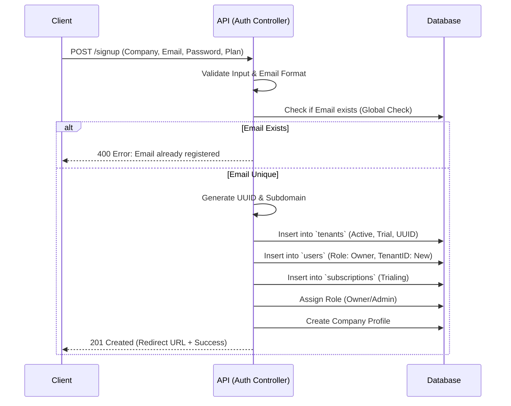

# Authentication & Onboarding Data Flow

## 1. Overview
This document details the flow for User Signup, Tenant Creation, and Authentication.

## 2. Signup Flow (New Tenant)
**Endpoint**: `POST /onboarding/signup`
**Controller**: `Onboarding::signup`

### Key Logic
*   **Tenant Creation**: A new record in `tenants` is created using the sanitized subdomain provided.
*   **User Association**: The new user is legally bound to this `tenant_id` immediately.
*   **Role Assignment**: An "Admin" role for the selected company type is assigned.
*   **Quick Access Flow**: A simplified onboarding where users verify via OTP and are automatically assigned to the "Trailing" (Default) plan. See `QuickAccessAuth` controller.

## 3. Login Flow
**Endpoint**: `POST /api/auth/login`
**Controller**: `Auth::login`

1.  **Scope Bypass**: The `Auth` controller uses `withoutTenant()` to search the `users` table globally by email.
2.  **Credentials**: `password_verify()` checks the hash.
3.  **Tenant Lookup**: Once the user is found, the system looks up their `tenant_id` to ensure the tenant exists and is active.
4.  **Token Generation**:
    *   **Payload**: User ID, Tenant ID, Email, Role.
    *   **Secret**: Signed with `JWT_SECRET`.

## 4. Client-Side Handling
*   **Storage**: The frontend stores the token and the `user` object (containing `tenant_id`) in `localStorage`.
*   **Subsequent Requests**: The logic in `api.ts` extracts the `user.tenant.subdomain` and sends it as the `X-Tenant-ID` header.
