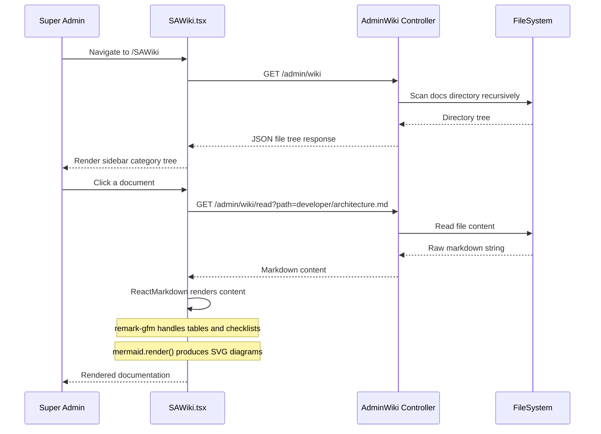

# Module Report: Admin Wiki
**Status:** ✅ Stable  
**Last Updated:** March 2026  
**Owner:** Product Team

---

## 1. Module Overview

The **Admin Wiki** is a live, in-portal documentation system available exclusively to Super Admins. It dynamically reads and renders all `docs/*.md` files from the file system at request time, providing a categorized, searchable documentation hub directly within the Super Admin portal — with no separate deployment or rebuild required.

```mermaid
graph TD
    A[Super Admin] --> B[Admin Wiki — /SAWiki]
    B --> C[Sidebar: Category Tree]
    B --> D[Content Area]
    C --> E[AdminWiki.php Controller]
    E --> F[/docs directory scan]
    F --> G{File Type}
    G -->|Directory| H[Category Folder]
    G -->|.md file| I[Doc File]
    H --> C
    I --> J[GET /admin/wiki/read]
    J --> D
    D --> K[ReactMarkdown + remark-gfm]
    K --> L[Rendered Tables, Code, Lists]
    K --> M[Mermaid.js Diagrams]

    style B fill:#7c3aed,color:#fff
    style K fill:#059669,color:#fff
    style M fill:#2563eb,color:#fff
```

---

## 2. Sub-Modules

| Sub-Module | Description |
|------------|-------------|
| **Sidebar Tree** | Auto-generated category tree from `docs/` directory structure |
| **Live Search** | Real-time filename filter in the sidebar |
| **Markdown Renderer** | Full GFM (GitHub Flavored Markdown) rendering via `react-markdown` + `remark-gfm` |
| **Mermaid Diagram Engine** | Renders `sequenceDiagram`, `graph`, `erDiagram`, `flowchart` blocks as SVGs |
| **Internal Link Navigator** | Relative `.md` links navigate within the wiki (no page reload) |
| **Code Syntax Highlighter** | Fenced code blocks with language-specific styling |

---

## 3. Functionalities & Status

| Functionality | Description | Status |
| :--- | :--- | :--- |
| **Directory Tree API** | Backend scans `docs/` and returns categorized file tree | ✅ Stable |
| **Markdown Content API** | Reads and returns raw `.md` file content | ✅ Stable |
| **Path Sanitization** | Prevents directory traversal attacks on file read endpoint | ✅ Stable |
| **Sidebar Navigation** | Collapsible folder tree, auto-expanded by category | ✅ Stable |
| **Live Search** | Filter documents by filename in real-time | ✅ Stable |
| **Table Rendering** | GFM pipe-style tables rendered as styled HTML tables | ✅ Stable |
| **Mermaid Diagrams** | sequence, graph, flowchart, erDiagram blocks → SVG | ✅ Stable |
| **Internal Link Navigation** | Relative `.md` links trigger in-wiki navigation | ✅ Stable |
| **Anchor Link Scrolling** | `#section` links scroll to the heading smoothly | ✅ Stable |
| **External Link Handling** | External URLs open in a new browser tab | ✅ Stable |
| **Code Block Styling** | Language-tagged fenced blocks styled with dark theme | ✅ Stable |
| **Full-Text Search** | Search within document content | 🔴 Planned |
| **Edit in Portal** | Edit `.md` files directly from the wiki UI | 🔴 Planned |
| **Version History** | Track changes to documentation over time (Git-based) | 🔴 Planned |

---

## 4. Technical Implementation

### Backend
- **Controller:** `App\Controllers\AdminWiki`
- **Base Class:** `CodeIgniter\RESTful\ResourceController`
- **Key Methods:**
  - `index()` — Scans `docs/` directory, returns categorized JSON tree
  - `read()` — Reads and returns raw content of a specific `.md` file
- **Security:** Path is sanitized and jail-broken paths are rejected

```php
// AdminWiki.php — Path sanitization
$safePath = realpath($docsBase . '/' . ltrim($path, '/'));
if (!$safePath || strpos($safePath, realpath($docsBase)) !== 0) {
    return $this->failForbidden('Invalid path');
}
```

### Frontend
- **Component:** `src/components/screens/Admin/SAWiki.tsx`
- **State:** Local React state (selectedPath, tree, content)
- **API Service:** `src/services/adminApi.ts`
  - `adminWikiService.getTree()` → `GET /admin/wiki`
  - `adminWikiService.getContent(path)` → `GET /admin/wiki/read?path=...`

### Libraries Used

| Library | Version | Purpose |
|---------|---------|---------|
| `react-markdown` | Latest | Markdown to React component rendering |
| `remark-gfm` | Latest | GitHub Flavored Markdown (tables, strikethrough, etc.) |
| `mermaid` | Latest | Diagram rendering (sequence, graph, flowchart, ERD) |
| `@tailwindcss/typography` | Latest | Prose styling for rendered markdown |

### API Endpoints

| Method | Endpoint | Description |
|--------|----------|-------------|
| `GET` | `/admin/wiki` | Returns categorized `docs/` directory tree as JSON |
| `GET` | `/admin/wiki/read?path=...` | Returns raw markdown content of the specified file |

### Routes
```php
// Routes.php
$routes->get('admin/wiki', 'AdminWiki::index', ['filter' => 'adminAuth']);
$routes->get('admin/wiki/read', 'AdminWiki::read', ['filter' => 'adminAuth']);
```

---

## 5. Rendering Architecture



---

## 6. Mermaid Diagram Support

The wiki supports the following Mermaid diagram types:

| Diagram Type | Syntax Tag | Use Case |
|-------------|------------|----------|
| **Flowchart** | `graph TD` / `graph LR` | Process flows, architecture diagrams |
| **Sequence Diagram** | `sequenceDiagram` | API flows, user journeys |
| **Entity Relationship** | `erDiagram` | Database schema documentation |
| **Class Diagram** | `classDiagram` | OOP structure documentation |
| **State Diagram** | `stateDiagram` | Workflow state machines |

**Implementation:** A custom `code` renderer in `ReactMarkdown` detects the `mermaid` language tag and calls `mermaid.render()` to produce an SVG, which is injected via `dangerouslySetInnerHTML`.

---

## 7. Internal Link Resolution

The wiki resolves links without modifying any `.md` files:

| Link Type | Resolution |
|-----------|------------|
| `[text](other.md)` | Navigate to `other.md` within the wiki |
| `[text](../folder/file.md)` | Resolve relative path and navigate |
| `[text](file.md#section)` | Navigate to file, then scroll to anchor |
| `[text](#section)` | Scroll to heading on current page |
| `[text](https://...)` | Open in new browser tab |

---

## 8. Documentation Structure Coverage

The wiki currently organizes documentation from these categories:

| Category | Files | Key Topics |
|----------|-------|-----------|
| **case-study/** | 8 files | Executive summary, architecture, features, sales, monetization |
| **developer/** | 6 files | Architecture, data flow, auth flow, invoice flow, security flow, workspace module |
| **product_manager_reports/** | 12+ files | Per-module status reports |
| **sales/** | 3 files | Feature comparison, pricing, enterprise onboarding |
| **testing/** | 8 files | Test strategies and per-module test reports |
| **Root** | 3 files | README, Plan Usage System, HR Plan |

---

## 9. Risks & Known Issues

| Risk | Severity | Status | Notes |
|------|----------|--------|-------|
| **Large `.md` files** | Low | Monitored | Very large files may cause slow API response; consider streaming |
| **Binary file access attempt** | Low | Mitigated | Controller only serves `.md` files; others are rejected |
| **Path traversal** | Medium | Mitigated | `realpath()` jail check prevents access outside `docs/` |
| **Mermaid render failures** | Low | Handled | Failed diagrams show error + raw code fallback |
| **No full-text search** | Medium | Planned | Currently only searches by filename in sidebar |

---

## 10. Metrics & KPIs

| KPI | Target | Current |
|-----|--------|---------|
| Page load time (sidebar) | < 500ms | ~300ms |
| Diagram render time | < 1s | ~800ms |
| Broken internal links | 0 | Monitoring |
| SA Wiki sessions/week | Baseline | Tracking |
| Documentation coverage | 100% of modules | ~85% (growing) |

---

## 11. Roadmap

| Quarter | Feature | Priority |
|---------|---------|----------|
| Q2 2026 | Full-text search across all `.md` files | High |
| Q2 2026 | Print/export current doc as PDF | Medium |
| Q3 2026 | Inline edit `.md` files from the wiki portal | Medium |
| Q3 2026 | Breadcrumb navigation trail | Low |
| Q4 2026 | Version history via Git integration | Low |
| Q4 2026 | Wiki analytics (most-viewed docs, dead links) | Low |

---

## 12. Related Modules

- [Administrative Portals](administrative_portals.md) — The Admin Wiki is part of the Super Admin Portal
- [Module Deep Dive Report](module_deep_dive_report.md) — Overview of all modules including Wiki
- All `developer/`, `testing/`, and `case-study/` docs are surfaced through this module

---

**Version:** 1.0.0  
**Last Updated:** March 2026  
**Status:** ✅ Stable
