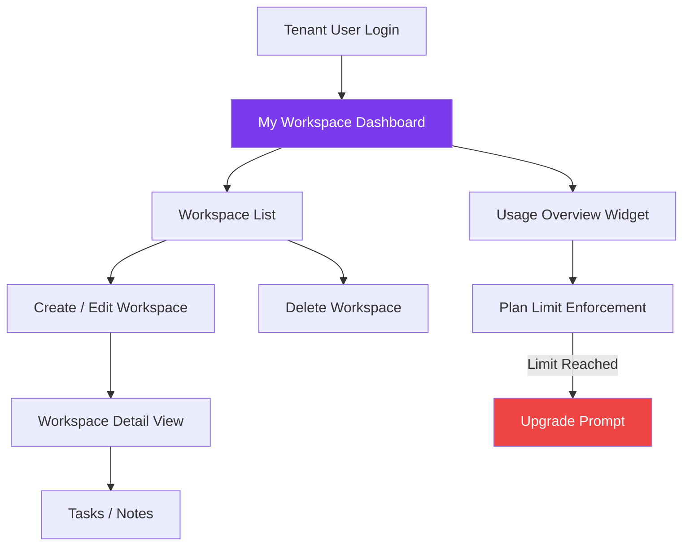
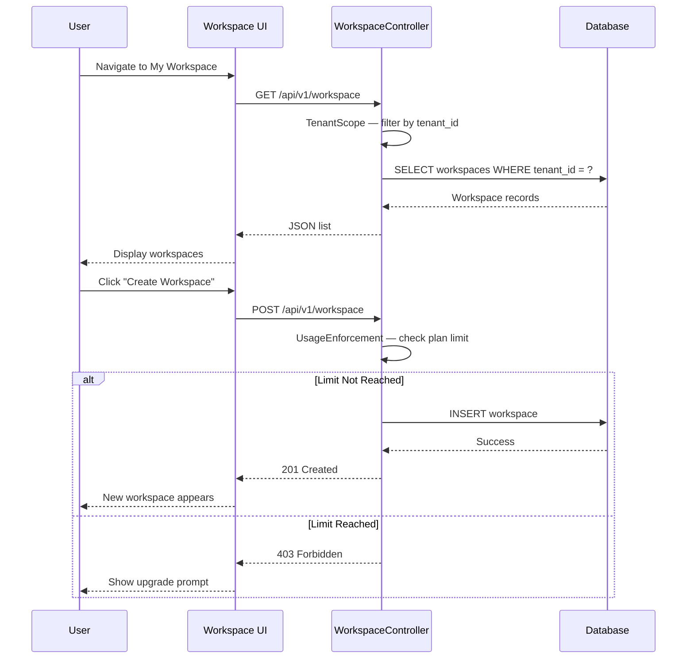

# Module Report: My Workspace
**Status:** ✅ Stable  
**Last Updated:** March 2026  
**Owner:** Product Team

---

## 1. Module Overview

The **My Workspace** module provides every tenant user with a personal productivity hub within the BillingTool platform. It acts as a personal project and task organizer, isolated per user, and is available only to tenants on qualifying subscription plans.



---

## 2. Sub-Modules

| Sub-Module | Description |
|------------|-------------|
| **Workspace Manager** | Create, edit, and delete personal workspaces |
| **Usage Overview Widget** | Displays real-time quota usage (invoices, users, storage) |
| **Plan Gate Enforcer** | Blocks workspace creation when plan limit is reached |
| **Upgrade Prompt** | Guides users to upgrade when limits are hit |

---

## 3. Functionalities & Status

| Functionality | Description | Status |
| :--- | :--- | :--- |
| **Create Workspace** | Users can create named workspaces with optional description | ✅ Stable |
| **Edit Workspace** | Inline editing of workspace name and details | ✅ Stable |
| **Delete Workspace** | Soft-delete with confirmation modal | ✅ Stable |
| **List Workspaces** | Paginated list of workspaces scoped to the current tenant user | ✅ Stable |
| **Plan Gate** | Workspace creation blocked when plan limit is reached | ✅ Stable |
| **Upgrade Prompt** | User sees an upgrade CTA when workspace limit is exceeded | ✅ Stable |
| **Usage Widget** | Live display of tenant's resource usage on the workspace dashboard | ✅ Stable |
| **Quick Notes** | Attach notes/tasks to a workspace | 🟡 In Progress |
| **Workspace Sharing** | Share a workspace with other users in the tenant | 🔴 Planned |

---

## 4. Technical Implementation

### Backend
- **Controller:** `App\Controllers\WorkspaceController`
- **Model:** `App\Models\WorkspaceModel`
- **Traits Used:**
  - `TenantScope` — Isolates all workspace records per tenant
  - `UsageEnforcement` — Checks plan limits before creation
  - `AuditTrait` — Logs all create/edit/delete actions

### Frontend
- **Component:** `src/components/screens/MyWorkspace.tsx`
- **State:** Zustand store (`workspaceStore`)
- **API Service:** `src/services/api.ts` → `/api/v1/workspace`

### API Endpoints

| Method | Endpoint | Description |
|--------|----------|-------------|
| `GET` | `/api/v1/workspace` | List all workspaces for current tenant user |
| `POST` | `/api/v1/workspace` | Create new workspace |
| `PUT` | `/api/v1/workspace/:id` | Update workspace |
| `DELETE` | `/api/v1/workspace/:id` | Delete workspace |

---

## 5. Plan Gating Logic

The workspace module uses the `UsageEnforcement` trait to dynamically check the tenant's active plan before any write operation:

```php
// WorkspaceController.php
public function create() {
    $this->enforceLimit('workspace'); // Throws 403 if limit reached
    // ... proceed with creation
}
```

**Plan Feature Matrix:**

| Plan | Workspace Access | Max Workspaces |
|------|-----------------|----------------|
| Starter (Trial) | ❌ No | 0 |
| Starter | ❌ No | 0 |
| Professional | ✅ Yes | 5 |
| Business | ✅ Yes | 20 |
| Enterprise | ✅ Yes | Unlimited |

---

## 6. User Journey



---

## 7. Risks & Known Issues

| Risk | Severity | Status | Notes |
|------|----------|--------|-------|
| **Plan limit enforcement race condition** | Medium | Monitored | Multiple simultaneous requests could exceed limit; DB-level constraint recommended |
| **Large workspace lists** | Low | Mitigated | Pagination implemented |
| **Notes feature incomplete** | Low | In Progress | Quick Notes sub-module still in development |

---

## 8. Metrics & KPIs

| KPI | Target | Current |
|-----|--------|---------|
| Workspace creation success rate | > 95% | Monitoring |
| Plan upgrade conversion from workspace limit prompt | > 5% | Tracking |
| Average workspaces per Professional tenant | 2-3 | Monitoring |
| Page load time | < 1.5s | ~1.2s |

---

## 9. Roadmap

| Quarter | Feature | Priority |
|---------|---------|----------|
| Q2 2026 | Quick Notes — attach tasks/notes to workspaces | High |
| Q2 2026 | Workspace sharing between tenant users | Medium |
| Q3 2026 | Workspace templates | Medium |
| Q3 2026 | File attachments per workspace | Low |
| Q4 2026 | Kanban-style task board | Low |

---

## 10. Related Modules

- [Billing & Subscription](billing_subscription.md) — Controls which plan grants workspace access
- [Administrative Portals](administrative_portals.md) — SA can view workspace usage per tenant
- [Auth & RBAC](auth_rbac.md) — Role-based access within a workspace

---

**Version:** 1.0.0  
**Last Updated:** March 2026  
**Status:** ✅ Stable (Core), 🟡 In Progress (Notes)
