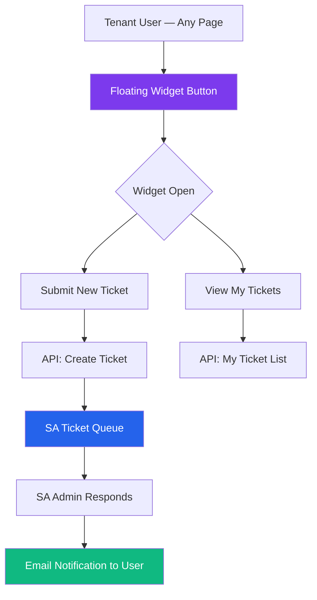
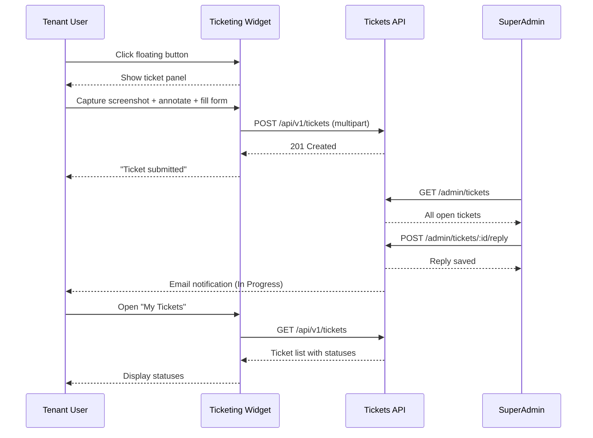

# Module Report: Ticketing Widget
**Status:** ✅ Stable  
**Last Updated:** March 2026  
**Owner:** Product Team

---

## 1. Module Overview

The **Ticketing Widget** is an embedded, floating customer support mechanism available to all tenant users on every page of BillingTool. Users can submit support tickets and track their status without leaving the app. All submissions surface in the **Super Admin Ticket Queue** for resolution by platform operators.



---

## 2. Sub-Modules

| Sub-Module | Description |
|------------|-------------|
| **Widget Shell** | Floating button + expandable panel, available site-wide |
| **Ticket Submission Form** | Title, description, category, and priority fields |
| **My Tickets View** | Status list of tickets submitted by the current user |
| **Screenshot Capture** | Captures viewport using `html-to-image` for bug reports |
| **Annotation Canvas** | Draw arrows, rectangles, and circles on captured screenshots |
| **SA Ticket Queue** | Super Admin portal module for viewing and resolving all tickets |
| **Email Notifications** | Email alerts to users when SA responds or ticket status changes |

---

## 3. Functionalities & Status

| Functionality | Description | Status |
| :--- | :--- | :--- |
| **Floating Widget Button** | Persistent button on all tenant-facing pages | ✅ Stable |
| **Submit Ticket** | Form with title, description, category, and priority | ✅ Stable |
| **Screenshot Capture** | Capture viewport screenshot with a single click | ✅ Stable |
| **Annotation Tools** | Draw arrows, rectangles, circles on screenshots (Undo/Redo) | ✅ Stable |
| **Auto Tenant Context** | Ticket tagged with tenant_id, user_id, page path, IP | ✅ Stable |
| **My Tickets List** | User views status of their own tickets within the widget | ✅ Stable |
| **SA Ticket Queue** | All tickets surface in Super Admin portal (`/SATickets`) | ✅ Stable |
| **SA Reply** | SA can add comments/responses to a ticket | ✅ Stable |
| **Status Transitions** | Open → In Review → Resolved → Closed | ✅ Stable |
| **Filter & Search (SA)** | Filter by status, tenant, priority; search by title/email | ✅ Stable |
| **Email on SA Reply** | User receives email when SA responds | 🟡 In Progress |
| **File Attachments** | Attach additional files beyond screenshots | 🔴 Planned |
| **Auto-escalation** | Escalate high-priority tickets after SLA breach | 🔴 Planned |

---

## 4. Technical Implementation

### Configuration
The widget endpoint is configured via environment variables:

```env
VITE_TICKETING_API_URL=https://your-api.com
VITE_TICKETING_API_KEY=your-api-key
```

### Backend
- **Controllers:** `App\Controllers\TicketController` (tenant), `App\Controllers\AdminTickets` (SA)
- **Models:** `App\Models\TicketModel`, `App\Models\ProjectModel`
- **Storage:** `public/uploads/tickets/{Year}/{Month}/` (screenshot JPGs)
- **Traits:** `TenantScope`, `AuditTrait`

### Known Technical Constraint
> `html-to-image` uses CSS canvas rendering, which does not support `oklch()` color values (used by Tailwind CSS v4). A workaround is applied to convert these values before capture.

### Frontend
- **Widget Component:** `src/components/TicketingWidget.tsx`
- **SA Module:** `src/components/screens/Admin/SATickets.tsx`
- **API Service:** `src/services/api.ts` → `/api/v1/tickets`

### API Endpoints

| Method | Endpoint | Description |
|--------|----------|-------------|
| `GET` | `/api/v1/tickets` | List tickets for the current tenant user |
| `POST` | `/api/v1/tickets` | Submit a new ticket (with optional screenshot) |
| `GET` | `/api/v1/tickets/:id` | Get ticket detail + reply thread |
| `GET` | `/admin/tickets` | SA: List all tickets across all tenants |
| `POST` | `/admin/tickets/:id/reply` | SA: Add reply to a ticket |
| `PUT` | `/admin/tickets/:id/status` | SA: Update ticket status |

---

## 5. Ticket Flow



---

## 6. Data Model

```
tickets
├── id (INT, PK)
├── tenant_id (INT, FK)
├── user_id (INT, FK)
├── title (VARCHAR)
├── description (TEXT)
├── screenshot_path (VARCHAR, nullable)
├── category (ENUM: billing, technical, general, feature_request)
├── priority (ENUM: low, medium, high, critical)
├── status (ENUM: open, in_review, resolved, closed)
├── created_at (TIMESTAMP)
└── updated_at (TIMESTAMP)

ticket_replies
├── id (INT, PK)
├── ticket_id (INT, FK)
├── user_id (INT, FK)
├── reply_text (TEXT)
├── is_sa_reply (BOOLEAN)
└── created_at (TIMESTAMP)
```

---

## 7. Risks & Known Issues

| Risk | Severity | Status | Notes |
|------|----------|--------|-------|
| **Email notification not fully implemented** | Medium | In Progress | SA replies don't yet trigger user emails |
| **Screenshot storage growth** | Medium | Monitored | High-res JPGs accumulate; consider periodic purge |
| **`oklch` rendering workaround** | Low | Active | Tailwind v4 color space not supported by html-to-image |
| **Mobile browser compatibility** | Low | Monitored | `html-to-image` may have artifacts on some mobile browsers |
| **No SLA tooling** | Medium | Planned | No auto-escalation after SLA breach |

---

## 8. Metrics & KPIs

| KPI | Target | Current |
|-----|--------|---------|
| Ticket submission rate | Baseline tracking | Monitoring |
| Average SA response time | < 24 hours | Tracking |
| Ticket resolution rate (72h) | > 90% | Tracking |
| Widget interaction rate | > 5% of active users/month | Monitoring |
| Screenshot attachment rate | Tracking adoption | Monitoring |

---

## 9. Roadmap

| Quarter | Feature | Priority |
|---------|---------|----------|
| Q2 2026 | Email notifications on SA reply | High |
| Q2 2026 | Video/screen recording support | Medium |
| Q3 2026 | Auto-escalation after SLA breach | Medium |
| Q3 2026 | AI-powered ticket auto-classification | Low |
| Q4 2026 | Real-time chat integration within widget | Low |

---

## 10. Related Modules

- [Administrative Portals](administrative_portals.md) — SA Ticket Queue lives in the Super Admin Portal
- [Billing & Subscription](billing_subscription.md) — Billing-related tickets are a common category
- [Auth & RBAC](auth_rbac.md) — Only authenticated users can submit tickets

---

**Version:** 2.0.0  
**Last Updated:** March 2026  
**Status:** ✅ Stable (Core + Screenshots), 🟡 In Progress (Email Notifications)
